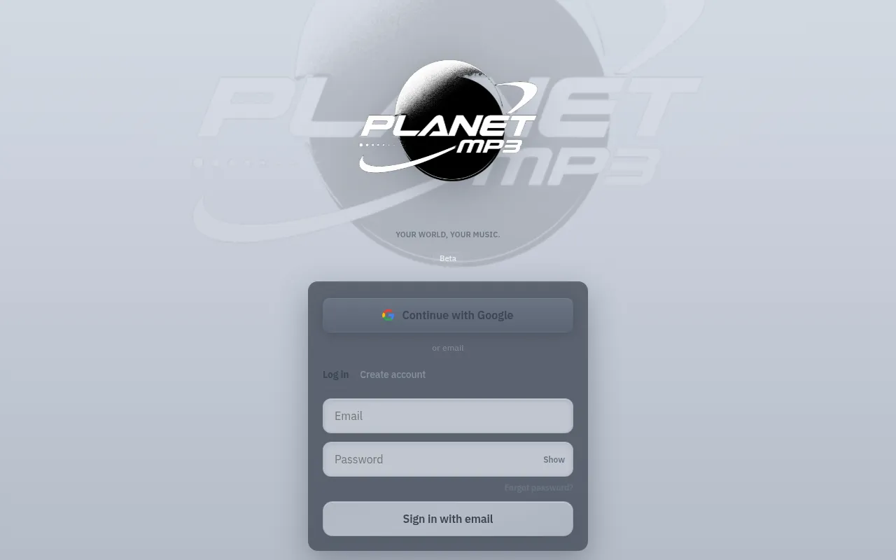
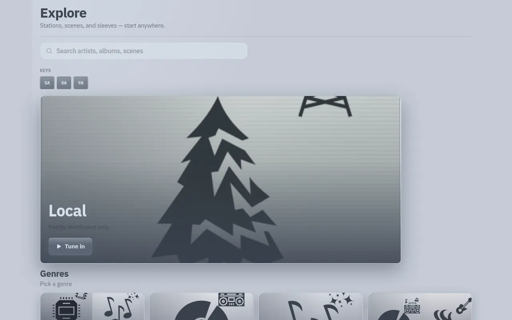
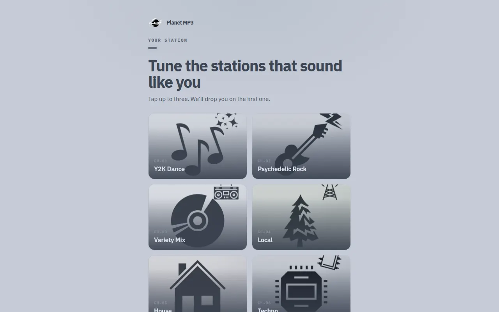
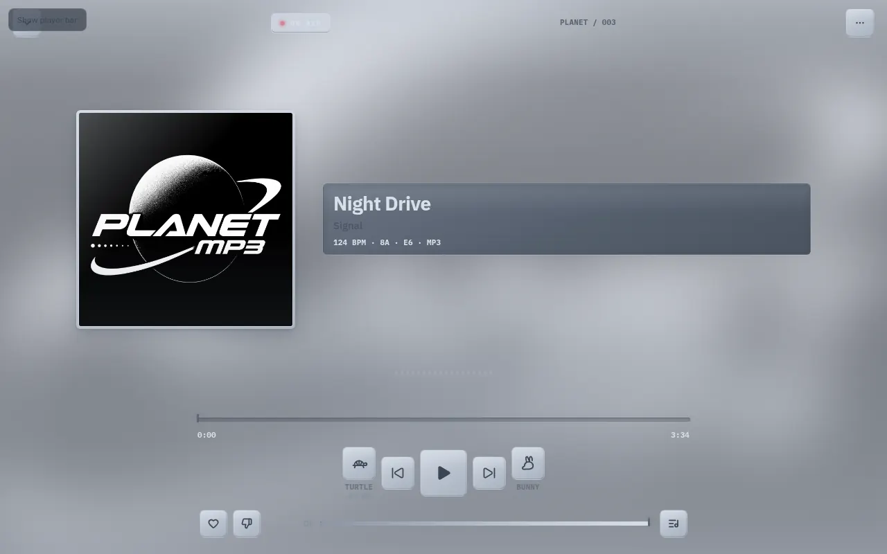
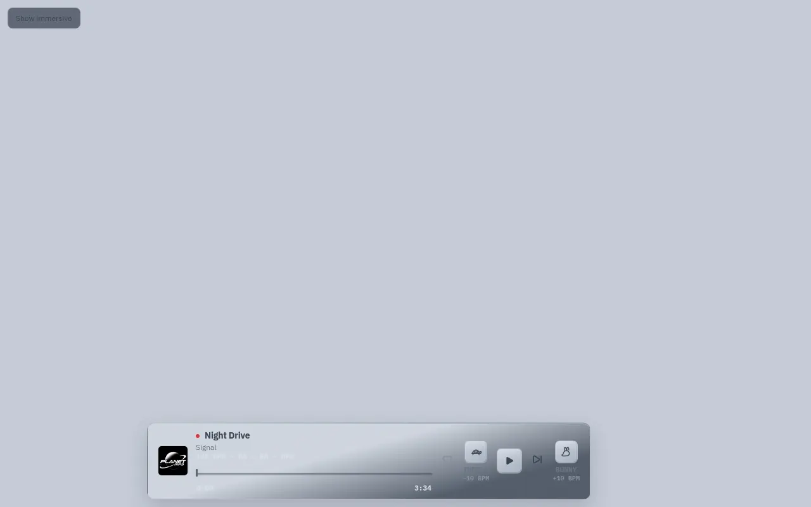
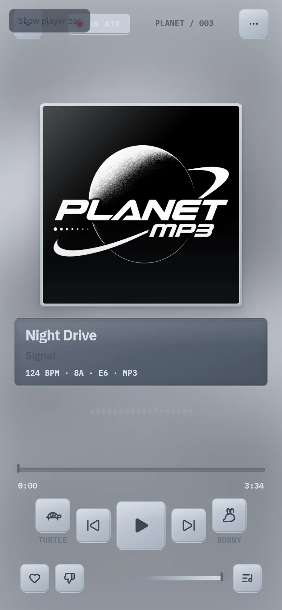
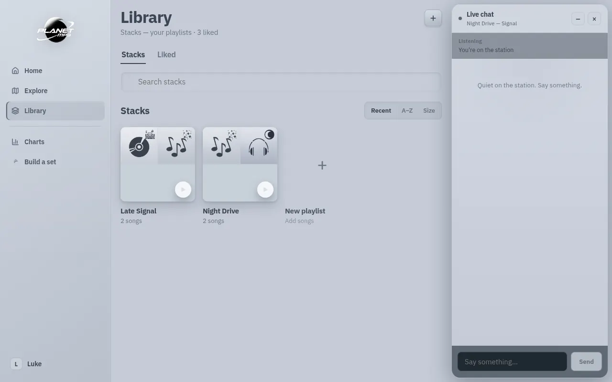
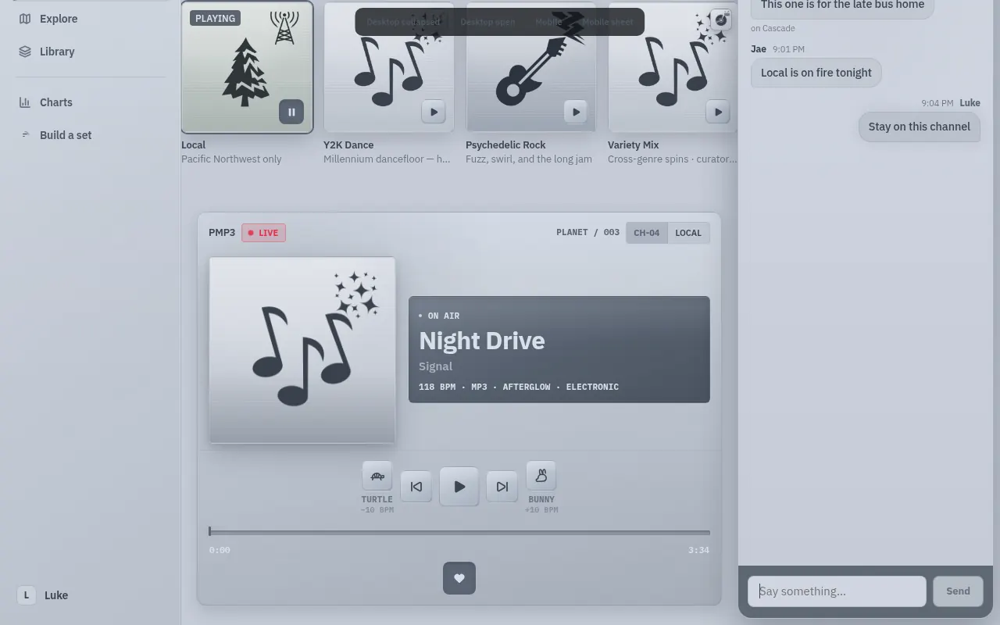
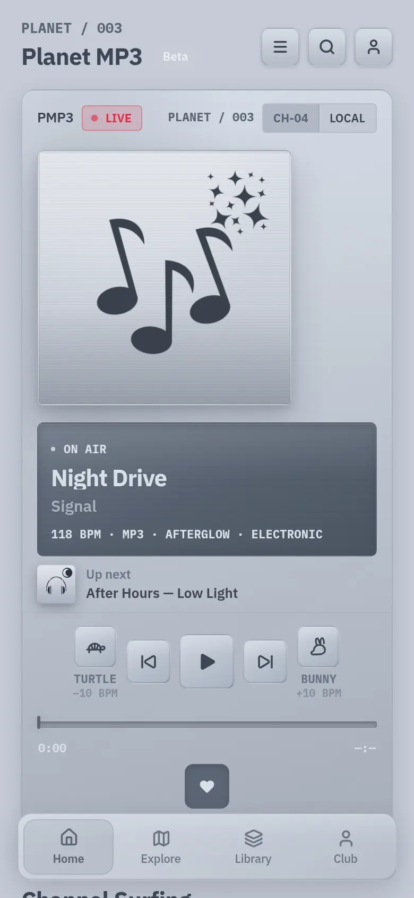

# PlanetMP3 — Creative & UX Audit (V2)

**Date:** 18 September 2026  
**Chassis scored:** `STYLE_CHASSIS = steel-chrome-20260918` (`src/theme.js`, `public/index.html`)  
**North star:** *A futuristic MP3 player from an alternate 2003* — playful, collectible, music-first, unmistakably PlanetMP3.  
**Method:** Code review of Home, Explore, Library, Club, Search, player, tokens, and motion; live inspection of `#broadcast-preview`, `#player-preview`, `#explore-preview`, `#onboarding-preview`, `#set-preview`, `#chat-preview`, and `#guide-preview` at desktop (1280×800) and mobile (390×844). **No product code was changed for this audit.**

This document **replaces** the earlier V2 scorecard (61/100 against `steel-y2k-20260918`). Related but not this scorecard: `docs/STEEL_Y2K_AUDIT.md` (pre-change brief), `docs/CREATIVE_DIRECTION_AUDIT.md` (acid-device notes), `docs/UX_AUDIT.md` (ergonomics/a11y), `docs/PLANETMP3_UI_AUDIT.md` (pre-Aqua MTV pass).

**Chassis history (do not re-litigate blindly):** Acid LCD → Steel Y2K → PS1 Discman costume (`#236`, orange phosphor + purple void) → reverted (`#237`) → **this pass:** one cool steel / chrome OS (`#C5CBD6` canvas, smoked LCD well, IBM Plex). This audit scores **what is on `main` now**.

Evidence from this pass: `docs/audits/creative-ux-v2/`.

---

## 1. Overall Score (/100)

**66 / 100** — band **Improve**.

PlanetMP3 is not a Spotify clone. The listening object is real. It is still not the product the V2 brief describes.

What landed since the last V2 pass is material: one steel OS (no black source list, no pearl/void split), pearl LCD titles, Camelot keys as actual LCD plates, a desktop immersive that is a **sleeve + LCD deck** rather than a blown-up phone, and shared `DeviceChrome` across hero / dock / immersive / mini. Those are the right bones.

What still reads in the room: **iPod Mini / iTunes 7 on the web.** Cool graphite on brushed steel, Game Icons as culture, Music.app Library, Apple Music Browse mosaic. The brief asks for modern product design × early digital music culture — PS1 panels, glass, collectible sleeves, underground metadata as *voice*. Steel Y2K delivered the *materials of a 2003 Apple player*. That is historically premium and culturally the wrong Planet.

Do **not** ship another Discman costume. The next identity leap is **steel as metal, phosphor as LCD only, sleeves as culture, one player drawing at three sizes.**

Approximate mix today: **45% light iPod / iTunes OS · 25% hardware/LCD tokens · 18% broadcast/station vocabulary · 8% underground metadata · 4% Planet mascot/splash.**  
Target mix: **40 / 25 / 20 / 15** (modern × Y2K device × underground × Planet).

| Category | Score (/10) | Weight | Weighted |
|---|---:|---:|---:|
| Brand Identity & Originality | 6.0 | 20 | 12.0 |
| Music Discovery & User Experience | 7.5 | 15 | 11.3 |
| Music Player & Playback Experience | 7.5 | 15 | 11.3 |
| Visual Language (Colour, Typography, Layout) | 6.0 | 15 | 9.0 |
| Interface & Interaction Design | 6.5 | 10 | 6.5 |
| Artwork & Editorial Presentation | 5.5 | 10 | 5.5 |
| Motion & Micro-interactions | 6.0 | 5 | 3.0 |
| Mobile & Responsive Experience | 7.5 | 5 | 3.8 |
| Design System Consistency | 6.5 | 3 | 2.0 |
| Technical Feasibility & Incremental Improvement | 9.0 | 2 | 1.8 |
| **TOTAL** | | **100** | **66** |

Scoring: **9–10 preserve · 7–8 refine · 5–6 improve · 0–4 redesign priority.**  
Weighted = `(score / 10) × weight`.

---

## 2. Detailed Scorecard

### 2.1 Brand Identity & Originality — 6.0/10 · **12.0 / 20**

**Evidence**
- Distinct nouns: crate, stacks, cuts, Channel Surfing, On Air, dedicate, Club, member numbers, `PLANET / 003`, Turtle / Bunny (`EnergyShiftButton.jsx`).
- Tagline `YOUR WORLD, YOUR MUSIC.` (`src/brand/identity.js`). Spinning-planet boot splash. Lockup on login is the strongest brand object in the product.
- Live Home: steel source list + aluminum hero device + station messenger. Channel tiles are Game Icons on steel plates — original drawings, iTunes genre-icon grammar.
- Theme header: one cool steel chassis; album art is supposed to supply hue. Accent locked to `#5B6574`. Acid / Aqua / Discman costume are retired (`App.test.js`, `styleShip.test.js`).
- Planet mascot exists (`PlanetMascot.jsx`) and only mounts on unused `CoverStage` (Home now uses `HeroPlayerCard`).

**What's working**
- Nobody else says “Flip the dial. Music stays on this stage.”
- Hardware keys + smoked LCD + catalog mark are a brand object in embryo. Mobile Home is the clearest Planet screenshot in the product.
- Club as a record club (membership card, vinyl groove stamp, credits) is closer to the brief than a settings dump.
- Onboarding (“Tune the stations that sound like you” + CH-01 plates) feels like programming a device, not picking Spotify genres.
- Login lockup + steel canvas is immediately Planet, not SaaS.

**Creative gaps**
- Signature colour in the brief is a **phosphor** (LCD-only). Shipped colour is **Apple graphite on pearl**. The product currently looks like **iTunes 7 / iPod Mini on the web**, not an alternate-2003 bootleg firmware.
- Identity is chrome (header, splash, bugs), not destinations. Library is Music.app playlists. Explore is Apple Music Browse with gray pictogram posters.
- Dual grammar, not dual palette: the **player** is a device; the **page** is still iTunes. One metal, two products.
- Mascot and planet are boot theatre. After login the listening OS does not carry them.

**Recommendations**
- Treat **steel as metal** (keys, bezels, page) and **phosphor as LCD only** (glyphs, pip, progress, focus). Do not flood CTAs and sidebar rows with green or orange paint. Do not revive `#236`.
- Put firmware on the player and dock (`PLANET / 003`, member number), not only Home `h1`.
- Keep pictograms as *channel bugs*; do not let them replace album art as the cultural object.
- Bring one Planet object into the listening OS (lockup pip, member stamp, or mascot as idle LCD sprite) — splash-only is costume.

---

### 2.2 Music Discovery & User Experience — 7.5/10 · **11.3 / 15**

**Evidence**
- Home order: **device first** → one `CrateSpread` → Channel Surfing → Tonight EPG → Most Requested rail → remaining `buildHomeCollections` rails (`HomeScreen.jsx`). Preview Home (no editorial tracks) shows Channel Surfing immediately under the hero.
- Explore: Mixmag-scale `ExploreHero`, genre mosaic, mood/scene rails, Camelot `KEYS` as real LCD plates (`5A` `8A` `9A`), search entry. Live hero is the **Local tree pictogram**, not a sleeve — because preview fixtures (and fallbacks) feed `CHANNEL_ART` as `albumCover`.
- Engines are underground: Camelot, BPM, energy shift, scene channels, hypno/near-this, dedicate, countdown (`harmony.js`, `EnergyRecommendationEngine.js`, `sceneChannels.js`).
- Four tabs: Home / Explore / Library / Club. Charts + Build a set live in the source list (`nav.js`). Onboarding is station-tuner, not genre chips.

**What's working**
- Discovery is **station-first**, which is the right Planet model (not an infinite For You feed).
- Crate spread is the first true record-shop module: lead sleeve + stacked cuts + LCD bits on the lead.
- Camelot keys are now firmware plates, not empty gray squares (fixed vs prior V2).
- Explained picks, empty-state voice, and “Listen in this lane” keep trust high.
- Set builder is a booth: length, vibe, energy waveform, Play set. That is collectible DJ culture.
- Four tabs is the right count. Do not add destinations.

**Creative gaps**
- After the crate, Home reverts to **equal snapping rails** and “See All” — App Store / Music.app grammar (`MusicSection`).
- Channel Surfing is still a **horizontal equal-tile strip**. Code is sleeve-first (`ChannelCard`, `sleeveFirstVisual`); when the catalog has no distinct covers (or preview uses channel icons as covers), the strip becomes an iTunes pictogram sheet.
- Explore restates Home (stations + crate + charts) with a blown-up Game Icon as the editorial hero. Copy says “Stations, scenes, and sleeves”; the hero is a pine tree drawing.
- Vocabulary (stacks, cuts, Near this) still under-glossed for first session. Library does gloss “Stacks — your playlists” (good).
- Dual chrome on desktop: source list *and* (on mobile) a floating pill dock. Muscle memory differs by breakpoint.

**Recommendations**
- One crate or mosaic per destination; rails become overflow, not the page.
- Channel Surfing: one featured dial (art-forward) + compact bugs; keep equal tiles as the rest of the strip.
- Never assign `CHANNEL_ART` as `albumCover`. Pictogram = bug. Sleeve = culture.
- Explore hero must be a catalog sleeve or licensed still. Idle cassette (`HERO_IDLE_ART`) is acceptable as a *device* object, not as a magazine cover.
- Keep four tabs. Gloss Stacks once. Do not add destinations.

---

### 2.3 Music Player & Playback Experience — 7.5/10 · **11.3 / 15**

**Evidence**
- Shared `DeviceChrome`: `LcdPanel`, `LcdSeek`, `LcdMetaLine` (`trackLcdBits` → BPM, Camelot, `E#`, **MP3 / bitrate**), `HardwareIconButton`, scanlines, `PLANET / 003`.
- Transport: Turtle · Prev · `PlayKey` · Next · Bunny, with `showLabel` / `±10 BPM` on Home hero, dock, and immersive.
- Desktop immersive (`.pmp-device-stage` from 860px) is **sleeve left, LCD right** — a device deck, not a phone in a blur. Mobile stacks sleeve → LCD → paddles.
- Plumbing is excellent: crossfade, Media Session, unlock, playback store, shuffle/repeat/volume, session resume (`docs/UX_AUDIT.md`).
- Contrast inversion (this chassis): LCD titles are pearl `color.lcdInk` on smoked steel (**fixed** vs prior dark-on-dark). `LcdMetaLine` and `LcdTimes` **hardcode** `color.lcdInk`, then get reused on the **light** dock / mini strip and under the immersive seek groove. Live mini: `124 BPM · 8A · E6 · MP3` is nearly invisible. Immersive artist uses `color.body` (`#4E5866`) inside the LCD well.

**What's working**
- There is a **player object**. Turtle / Bunny are first-class hardware, not a buried flask slider.
- Technical metadata is on the LCD where it belongs: `118 BPM · MP3 · AFTERGLOW · ELECTRONIC` on Home; `124 BPM · 8A · E6 · MP3` on immersive.
- Desktop deck layout matches the brief’s “device-inspired panels” better than any previous chassis.
- Booth tools (dedicate, scene surf, energy arc) are demoted to a drawer — correct hierarchy.
- Energy shift is the most Planet interaction in the product (tap ±10 BPM, long-press menu, haptic).

**Creative gaps**
- Three drawings of the same device: Home hero (bezel + LCD + keys), light dock strip (metadata on pearl), immersive (sleeve theatre + LCD). Shared tokens, not one object.
- Dock / mini metadata fails WCAG on the light strip because LCD ink was designed for the dark well.
- Seek times under immersive sit on the aluminum canvas in pearl — faint.
- Home still runs a **full device** and a **dock** (hero visibility observer). Mobile Channel Surfing tucks under the pill dock.
- Bitrate is often the word `MP3` (on-brand as format) rather than a real kbps readout when the catalog has it.
- Immersive “On Air” glass chip and preview “Show player bar” collide on mobile.

**Recommendations**
- One LCD token pair: `lcdInk` / `lcdMute` **only inside `LcdPanel`**. On light metal, use `color.accent` / `color.ink` (as `TrackCard` already does).
- Put a recessed LCD well on the dock/mini (even 28px tall) so metadata stays firmware, not caption gray.
- Artist inside `LcdPanel` must be `color.lcdMute`, never page `color.body`.
- Keep Turtle / Bunny. Do not hide them behind flask UI.
- One always-present transport: hero is display when docked; dock is the device when the hero is off-screen. Stop fighting two play keys.

---

### 2.4 Visual Language (Colour, Typography, Layout) — 6.0/10 · **9.0 / 15**

**Evidence**
- Canvas `#C5CBD6`, ink `#3D4654`, accent `#5B6574`, LIVE `#E0314A`. IBM Plex Sans + Mono. Compact LCD type (`type.lcd`: 11px, 700, uppercase). 8–12px engineered corners (`radio.radius`).
- Theme promises “album art supplies hue.” Live page is **uniform cool gray**; art tint is a 12% wash at best (`HeroPlayerCard` radial, desktop `glowRgb` at 0.07).
- Bold sans titles (`clamp(22px, 5vw, 32px)` on LCD; Explore 26–40px). Metadata is the right voice when contrast holds.
- Set builder energy graph is the only cyan/phosphor in the product (`EnergyArc` uses `y2k.cyan`, which is aliased to steel in the token file but **renders aqua** in the waveform). Token name ≠ pixel.

**What's working**
- One metal. No black void, no white page, no neon flood. That cohesion is a real upgrade from the three-machine OS.
- Type pairing is correct for the brief: display sans + compact technical mono.
- Hardware keys read as aluminum, not glass pills (`hardwareKey` explicitly drops `backdrop-filter`).
- LIVE red is the only alarm colour — used sparingly, correctly.

**Creative gaps**
- The brief’s **PS1 + glassmorphism + phosphor LCD** is not this palette. This is PowerBook G4 / iPod Mini. Premium, Apple, not underground.
- No signature LCD light. Progress fill is silver (`#8B95A4 → #D8DFE8`). Focus is graphite. The product cannot be spotted at 40px.
- Layout still shelves-and-rails. Device panels exist on Home/player; Explore/Library/Charts are streaming pages on steel paint.
- `y2k.cyan`, `y2k.offWhite`, `IceOrbPlay`, `glassPill` are leftover names describing a previous product.

**Recommendations**
- Phosphor **only on the LCD**: seek fill, pip, selected Camelot plate, maybe the live meta row. Steel everywhere else. One colour, one surface — not a theme swap.
- Let sleeve colour actually wash the hero bezel (raise the 12% tint until the device feels like the record).
- Keep IBM Plex. Do not swap in a display costume font (already proven by `#236`).
- Rename leftover tokens when touching those files; do not run a rename-only PR.

---

### 2.5 Interface & Interaction Design — 6.5/10 · **6.5 / 10**

**Evidence**
- Hardware keys, 36–52px play, Turtle/Bunny paddles, LCD seek groove, chrome icon buttons in the masthead.
- Desktop: 232px source list (`AppSidebar` “Source list” aria), main stage, Live chat rail. Classic iTunes 3-column.
- Mobile: `PLANET / 003` masthead, device hero, four-tab pill dock (`BottomNavigation` comment still says “dark device selector”).
- Library: iOS large title, Stacks / Liked, Search stacks, Recent · A–Z · Size segmented control, playlist mosaics.
- Charts: Billboard list + pictogram #1 card, Overall / Channel / Genre, This month / Climbers.

**What's working**
- Primary controls feel like keys, not Material buttons.
- Chat as a station window (not a Slack clone) is on-brief; presence + now-playing in the header is radio.
- Feature tour is a device manual in embryo (“01 Home — Channel Surfing”).
- Press states (`hardware.keyPressed`), `pmp-press`, `pmp-lift` exist.

**Creative gaps**
- Library, Charts, and the sidebar are **Music.app skins**. They undo the device the hero just established.
- Dock is crowded (art, title, LCD bits, like, more, play, turtle, bunny, seek). Nine targets on a 88px strip.
- Overlay/sheet language is still generic glass (`glassSheet`), not PS1 HUD panels.
- Mobile drawer is a settings list (“Browse”) rather than a device selector.

**Recommendations**
- Keep IA. Restyle Library as a crate (jewel stacks, LCD counts, no iOS segmented chrome).
- Sidebar as a steel faceplate with firmware labels, not a source list.
- Dock: art + title + play + one paddle pair. Like / more live in immersive.
- Sheets: 8px radius, hairline bezel, LCD header — reuse `LcdPanel` + `radio.moduleFace`.

---

### 2.6 Artwork & Editorial Presentation — 5.5/10 · **5.5 / 10**

**Evidence**
- Jewel-case `artFrameStyle` (6px radius, raised sleeve, active ring). `CrateSpread` oversized lead. Channel cards *code* sleeves-first with pictogram corner bug.
- Live previews feed `CHANNEL_ART` as cover URLs, so Home, Explore, Charts, Library, and genre focus all show **the same steel pictogram sheet**. Production with real `albumCover` values will look better; fallbacks and Explore hero still blow up Game Icons.
- Explore hero comment: “Mixmag-scale photography… never a generated plate.” Pixel: a pine tree on brushed metal, Ken Burns 32s, dark gradient, “Tune in.”
- Idle hero cassette (`hero-idle.png`) is the right *device* still. Using it as album art is not.

**What's working**
- When a real sleeve is present, the frame is collectible (shadow, chrome edge, slow scale while playing).
- Crate spread is editorial, not a grid of equal SaaS cards.
- Channel bugs on top of sleeves (when both exist) is the right hierarchy.
- Video stage exists for tracks with `videoUrl`.

**Creative gaps**
- Artwork is **not** the primary visual of discovery. Pictograms are.
- Charts #1 is a notes icon in an LCD plate — a magazine chart would be a sleeve.
- Genre mosaic is Apple Music Browse density with iTunes icons. Mixmag without photography is just a mosaic of glyphs.
- No liner-note / flypost / jewel-case inner-tray language on album pages beyond existing `LinerNotesSheet`.

**Recommendations**
- Hard rule: `albumCover` is a catalog image or nothing. Channel art is `bug`, never `src`.
- Explore hero: largest sleeve in the lane, or idle cassette, never a 1200px pictogram crop.
- Charts lead: sleeve at 132–200px, rank as LCD stamp.
- Keep jewel radius 6. Do not round to pills.

---

### 2.7 Motion & Micro-interactions — 6.0/10 · **3.0 / 5**

**Evidence**
- Documented principles (`src/motion/tokens.js`): rhythm over bounce, atmosphere slower than chrome, reduced motion honored globally (`index.css`).
- Live: LCD pip, sleeve crossfade (`trackSwap` 0.32s), Ken Burns on Explore, dock rise, like pop, planet spin, scanline wash at 4.5% on LCD, energy-shift flask shake (if flask shown).
- Hardware keys transition transform/color; no click-down travel that reads as a physical key.

**What's working**
- Motion is calm and music-adjacent. Nothing bounces. Reduced motion is real.
- Track change on the LCD/sleeve is the right beat.
- Energy shift haptic + pill feedback is tactile.

**Creative gaps**
- Playful / collectible is missing. No tray-open, no jewel click, no tuner detent, no cassette-door.
- Scanlines are almost invisible (correct for not-costume; they also don’t register as LCD).
- Two motion systems (`theme.motion` and `src/motion/tokens.js`) with slightly different durations.

**Recommendations**
- One press: `translateY(1px)` + inset shadow on hardware keys (already tokenized as `keyPressed` — use it everywhere, including PlayKey).
- Sleeve swap: 200–240ms crossfade only. Do not add 3D flip libraries.
- Unify on `theme.motion`. Do not add animation dependencies.

---

### 2.8 Mobile & Responsive Experience — 7.5/10 · **3.8 / 5**

**Evidence**
- Mobile Home is the **best Planet surface**: `PLANET / 003`, LIVE + CH ident, jewel sleeve, smoked LCD, Turtle/Bunny, seek, four-tab dock.
- Crate spread stacks to one column at 560px. Device stage goes row at 860px.
- Safe areas, `100dvh`, dock `maxWidth: 560`. Drawer duplicates sidebar IA.
- Desktop mini uses `left: 232; right: 348` (chat column). Player-preview on a 390px viewport left a vertical sliver — preview scaffolding, not production GlassDock.

**What's working**
- The phone *is* the MP3 player. That is the brief.
- Tabs + player dock is the right mobile IA.
- Hero wraps (sleeve then LCD) instead of shrinking into unreadability.
- Onboarding and Set builder hold up at 390px.

**Creative gaps**
- Hero + dock both present: Channel Surfing sits under the pill nav; PLAYING tiles clip.
- Desktop 3-column is iTunes; it does not feel like a larger device, it feels like a different app.
- Chat rail on desktop is strong; mobile chat was not a first-class object in the Home preview (pill exists in code).

**Recommendations**
- When the hero is in view, collapse the dock to tabs-only (or a 4px LCD pip). When the hero leaves, expand the full mini.
- Desktop: treat the center column as the device, not a website with a sidebar. Hero can grow; rails stay crate-width.
- Don’t special-case player-preview layout as if it were production mobile.

---

### 2.9 Design System Consistency — 6.5/10 · **2.0 / 3**

**Evidence**
- `theme.js` is a real OS: type scale, `radio` / `hardware` / `glass` / `dock` / `artFrameStyle`, `STYLE_CHASSIS` stamped into HTML and tests.
- Leftovers: `CoverStage.jsx` (dark cinematic veil, unused by Home), `IceOrbPlay` alias, `y2k.cyan` = steel in tokens / aqua in the set waveform, Explore hover `rgba(28,32,40,…)`, Library hairlines `rgba(216,223,232,0.06)` (invisible on light canvas), `LcdMetaLine` not context-aware.
- Comments still say App Store, Music.app, iTunes source list, acid pip.

**What's working**
- Tokens have a written point of view. Tests lock canvas, accent, chassis id, IBM Plex, no Syne, no aqua RGB.
- Shared `DeviceChrome` is the highest-leverage system piece in the repo.

**Creative gaps**
- LCD ink used off-LCD. Page ink used on-LCD. That is the consistency bug that costs the most creative points.
- Dead CoverStage still implies a second visual OS.
- Naming lag (Aqua, Ice, y2k.cyan) makes the next contributor paint the wrong decade.

**Recommendations**
- `LcdMetaLine({ on: "lcd" | "metal" })` — one component, two inks.
- Delete or quarantine `CoverStage` once confirmed unused in production routes.
- No new glass/pill APIs. Reuse `hardwareKey`, `LcdPanel`, `artFrameStyle`.

---

### 2.10 Technical Feasibility & Incremental Improvement — 9.0/10 · **1.8 / 2**

**Evidence**
- Highest-impact work is token, hierarchy, and art-source — not a rewrite. `DeviceChrome` already shared. Sleeve-first helpers already exist (`sleeveFirstVisual`, `ChannelCard`).
- No new dependencies required. Constraint honored.
- Engines, billing, auth, audio, routing should not move.

**What's working**
- Incremental path is obvious. Previous costume rewrite (`#236`) is the anti-pattern.
- Preview hashes make creative QA cheap.

**Creative gaps**
- `App.jsx` is still a god file; not a creative-score issue except that player/dock/hero duplication lives there.

**Recommendations**
- Ship contrast + sleeve-first + LCD phosphor as three small PRs. Do not open a visual-OS epic.

---

## 3. Top 10 Strengths

1. **A real MP3 device on Home** — bezel, jewel window, smoked LCD, Turtle/Bunny, `PLANET / 003`, LIVE, CH ident.
2. **Station-first discovery** — Channel Surfing, on-air, dedicate, tonight’s guide, not a For You feed.
3. **Underground metadata as firmware** — BPM, Camelot, energy, MP3 on the LCD.
4. **Turtle / Bunny energy shift** — unique, tactile, tied to a real recommendation engine.
5. **Desktop immersive as a deck** — sleeve + LCD side by side from 860px.
6. **One steel chassis** — no black void, no white page, IBM Plex locked by tests.
7. **Club as a record club** — membership card, vinyl stamp, member numbers, credits.
8. **Onboarding as station programming** — CH-01 plates, not Spotify genre pills.
9. **Shared DeviceChrome** — the system can actually converge on one player object.
10. **Login lockup + spinning planet** — the door is Planet. Keep it.

---

## 4. Top 10 Creative Gaps

1. **iPod Mini, not alternate-2003 Planet** — graphite on pearl, no LCD phosphor, Apple-premium instead of bootleg firmware.
2. **Pictograms as culture** — Game Icons stand in for album art across Home, Explore, Charts, Library fallbacks.
3. **Explore hero is a blown-up tree drawing** — magazine layout, iTunes photography.
4. **Library is Music.app** — large title, segmented sort, playlist mosaics.
5. **LCD ink on light metal** — dock/mini BPM line is unreadable; immersive artist uses page body colour on the LCD.
6. **Two player drawings** — hero device vs light dock strip vs immersive theatre.
7. **Home dual transport** — full device + dock; Channel Surfing clips under the pill.
8. **Sleeves do not colour the OS** — art-as-hue is a comment, not a picture.
9. **Planet mascot is splash-only** — CoverStage unused; listening OS has no creature.
10. **“See All” rails after the crate** — App Store grammar where a record shop should be.

---

## 5. P0 (Essential) Improvements

Highest impact, no new dependencies, current components only.

1. **LCD ink is contextual.** `LcdMetaLine` / `LcdTimes` / artist-in-panel: pearl on smoked well, graphite on aluminum. Fixes dock, mini, immersive seek, immersive artist. Files: `DeviceChrome.jsx`, `GlassDock.jsx`, `DesktopMiniPlayer.jsx`, `ImmersivePlayer.jsx`.
2. **Sleeve-first hard rule.** Never use `CHANNEL_ART` as `albumCover`. Pictogram = corner bug. Hero / Explore / Charts / genre plates fall back to idle cassette or mosaic of *real* covers. Files: `explore.js`, `channelArt.js`, preview fixtures, `ExploreHero.jsx`.
3. **One dock LCD well.** Recess a 24–32px `LcdPanel` on the mini/dock so BPM · key · time is firmware, not caption. Reuse existing `LcdPanel`.
4. **Hero vs dock.** When `HeroPlayerCard` is in view, dock is tabs-only (or a pip). When it leaves, dock is the device. Stop two play keys.
5. **Explore hero is a sleeve.** Largest catalog cover in the lane, Ken Burns optional, “Tune in” stays. No 1200px Game Icon crop.

---

## 6. P1 (Important) Improvements

1. **Phosphor on LCD only** — seek fill, pip, selected Camelot, live meta. Steel everywhere else. Do not restyle the app acid/orange.
2. **Channel Surfing featured dial** — first tile art-forward and larger; the rest compact with bugs.
3. **Library as crate** — jewel stacks, LCD counts, drop iOS segmented chrome.
4. **Sidebar as faceplate** — firmware labels, steel plate, not “Source list.”
5. **Sleeve wash on the hero bezel** — raise track-colour tint until the device feels like the record.
6. **Planet in the listening OS** — lockup pip on LCD idle, or mascot as a 24px CH bug, not a second CoverStage.
7. **Club card as the collectible destination** — already close; lead with the card, demote Settings tabs visually.
8. **Quarantine `CoverStage`** — dead dark-veil OS. Don’t let it leak back into Home.

---

## 7. P2 (Polish) Improvements

1. Hardware key press travel (`keyPressed`) on every PlayKey.
2. Real kbps when `track.bitrate` exists; keep `MP3` as the format glyph.
3. Unify `theme.motion` vs `src/motion/tokens.js`.
4. Rename leftover Aqua/Ice/cyan identifiers when those files are already open.
5. Feature tour as a printed device insert (already close).
6. Time-of-day steel wash is almost invisible — either commit or delete.
7. Chat composer as a hardware send key, not a generic Send pill.
8. Charts lead sleeve + LCD rank stamp.

---

## 8. What not to do

- Do not revive the `#236` Discman costume (orange phosphor page, purple void, display-font swap).
- Do not add animation, 3D, or icon-pack dependencies.
- Do not add tabs, a For You feed, or Spotify-style cards.
- Do not rebuild IA, engines, billing, or audio.
- Do not make the whole app dark again to “feel more music.”

---

If I could only implement five changes, they would be:

1. **Make LCD ink contextual** — pearl metadata only inside the smoked well; graphite on aluminum so BPM, Camelot, and time are readable on the dock and mini.
2. **Enforce sleeve-first culture** — album artwork is the visual of Home, Explore, Charts, and Library; Game Icons stay as channel bugs, never as covers.
3. **Finish one player object** — recessed LCD well on the dock/mini, same Turtle / Prev / Play / Next / Bunny drawing as the hero and immersive.
4. **Light the LCD, not the page** — a single phosphor for seek fill, pip, and selected key so Planet is not iPod Mini graphite.
5. **Replace the Explore (and Charts) pictogram posters with sleeves** — magazine-scale art of real records, so discovery feels collectible instead of iTunes Browse.
