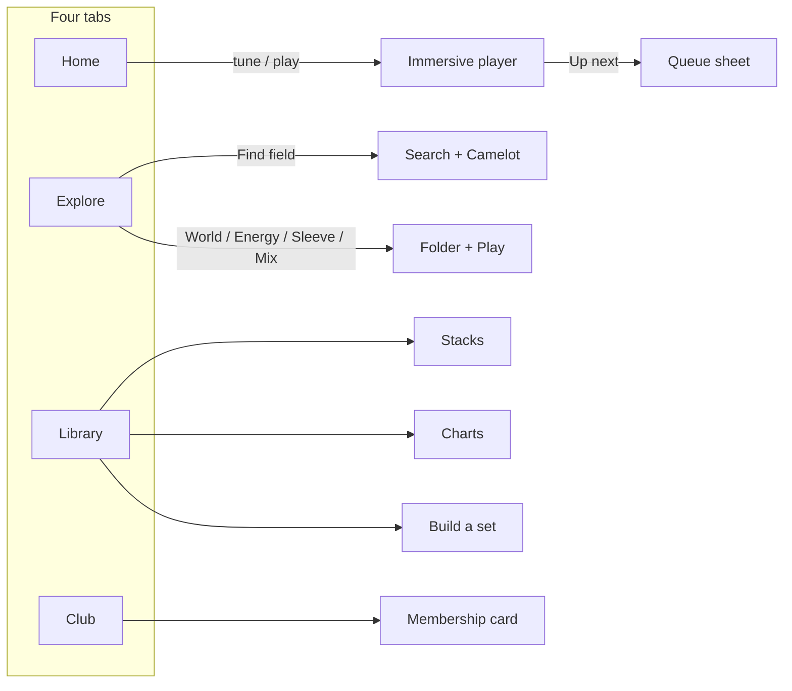

# PlanetMP3 — Mobile UX Audit

**Date:** 21 September 2026  
**Chassis:** `steel-ps1-glass-20260919`  
**HEAD:** dock collapse `#263` + Explore directory `#262`  
**Scope:** layout, hierarchy, navigation, usability, intuitiveness. Not performance or code quality.  
**Method:** screen-by-screen code review of the live IA, plus inspection of `#broadcast-preview`, `#explore-preview`, `#player-preview`, `#onboarding-preview`, `#set-preview`, `#guide-preview-club`, `#chat-preview`, and `/` at **390×844**.  
**Question on every screen:** *Would a new user immediately understand what to do here?*

Screenshots: [`docs/audits/mobile-ux-20260921/`](audits/mobile-ux-20260921/).

This is a **product/UX** scorecard. It does not replace [`docs/CREATIVE_UX_AUDIT_V2.md`](CREATIVE_UX_AUDIT_V2.md) (visual identity) or [`docs/UX_AUDIT.md`](UX_AUDIT.md) (ergonomics already shipped). Several items from those docs are now done (ranked search, Camelot rail, stack editing, shuffle/repeat on the immersive deck). The remaining pain is **mobile comprehension**.

---

## 1. Overall Score — **61 / 100**

PlanetMP3 already has a listening object a new user can recognize: a steel MP3 player with a jewel sleeve, an LCD of BPM / key / energy, and a big play key. Login, onboarding, the immersive player, Explore’s `.MP3` folder, and the Club card all feel like the same Y2K device.

What fails is the **phone around that object**. Home has no title, three unlabeled header icons, a hamburger that duplicates the tab bar, and Channel Surfing sitting under the dock. Search is a glyph. Charts and Build a set live in three places. The mini player is documented as “Apple Music–style” and, when expanded, becomes a second deck on top of the feed. A first-time listener can start music. They cannot map the product.

**Band: Improve.** Do not redesign the player, the Club card, or Explore’s crate metaphor. Fix the phone chrome so the device can be used without a tour.

---

## 2. Scorecard

Weighted = `(score / 10) × weight`.

| Category | /10 | Weight | Weighted | What’s working | Problems | Specific fixes |
|---|---:|---:|---:|---|---|---|
| **Layout & Hierarchy** | 6.0 | 20 | 12.0 | Hero is the first object. Explore / Library / Charts have real titles. Artwork can dominate (Charts #1, Worlds, immersive sleeve). | Home is untitled. Tonight’s “Today · 2 blocks” strip is a TV-guide nobody asked for. Channel Surfing is the second destination and is clipped by the dock on a 844px phone. Ticker is truncated into the bezel. Expanded mini covers the feed *and* the tab labels. | Keep the hero. Pull Channel Surfing fully above the dock (one complete station row). Kill or demote the Today/blocks strip. Never expand a second transport over content. |
| **Navigation** | 5.5 | 20 | 11.0 | Four tabs is the right model: Home / Explore / Library / Club. Active states work. Library already glosses “Stacks — your playlists.” | Search is an icon, not a place. Hamburger (“Browse”) opens **Faceplate**, which repeats Home / Explore / Library. Charts + Build a set appear in the drawer, on Library, and in the 8-step tour. Club is profile + settings + guide. Chat is a right-edge nub. | Tabs only for primary destinations. Hamburger = overflow (Charts, Build a set) — rename it, don’t duplicate tabs. Search lives in Explore’s find field + a labeled Home control. Chat is a pill above the dock. |
| **Intuitiveness** | 5.0 | 20 | 10.0 | Login is obvious. Idle hero says **Start listening**. Stack detail has Play. Explore folder has Play. Set builder has **Play set**. Onboarding: “Tap up to three.” | “Faceplate,” “cuts,” “Worlds,” “Sleeves,” “Mix,” “Booth,” “Pace,” “Channel Surfing,” “Directory” are never taught in context. Slow / Fast does not say it steers *what plays next*. Mix board is a Camelot pad with no “this is musical key.” Header icons have no text. Feature tour is 8 cards that describe screens the user still can’t find. | Gloss on first use, in place. Three-beat tour max: Home = radio, Explore = crate, Library = yours. Pace: “Slower / faster picks.” Mix: “Keys that mix.” |
| **Player UX** | 7.5 | 15 | 11.3 | Immersive player is the best screen in the product: sleeve, LCD (`124 BPM · 8A · E6 · 320 KBPS`), hardware prev/play/next, like, dislike, Slow–Fast, volume, Up Next. Hero is a real device, not a card. Dock play/skip are 44px. Production already hides the mini while the Home hero is on screen (`hideDockPlayer`). | Three decks (hero, expanded mini, immersive) share the same controls. Tap on the mini *expands* instead of opening now-playing. Volume exists on the deck *and* in ⋯. Shuffle/repeat vanish in radio mode with no explanation. Queue is a tiny icon. Pace long-press is invisible. | Mini tap → immersive. Keep collapsed mini to cover + title + play/skip. Pace stays on the *one* visible deck. Queue as “Up next” text in the LCD, not only an icon. |
| **Discovery & Browsing** | 6.5 | 10 | 6.5 | Worlds lead with sleeves. Energy rooms are one tap-to-play grid. Sleeves wallet is jewel-case first. Mix wheel is a genuine differentiator. Charts puts #1 art huge with **Play this chart**. Explore focus lists `01  DEEP_FLOOR.MP3`. Track *tiles* already print BPM/key. | Channel tiles are pictograms, so Home’s “music-first” promise breaks at the first shelf. Search is not a tab. Energy/Sleeves/Mix tabs are 10px uppercase. Track *rows* hide BPM/key. Mix empty pads look broken. Most Requested appears on Home and Charts. | One Channel row that looks like music (sleeve-led). Keep Explore modes; enlarge the tabs and drop the poetry line or make it one plain sentence. Print BPM/key on list rows and in the `.MP3` folder. |
| **Interaction Design** | 6.0 | 5 | 3.0 | Hardware keys, like-pop, jewel frames, 44px play on the dock, set-builder length chips, haptic on Club. | Header / plus / menu chrome is **36px**. Mix A/B pads are tight. Expanded mini’s prev/heart sit on top of Channel art. Drawer does not cover the dock. Vibe copy truncates (“Builds up, peaks, then ea…”). | 44px for every header control. Expanded mini goes away (see Player). Drawer is a full-height sheet. |
| **Visual Consistency** | 6.5 | 5 | 3.3 | One steel canvas, LCD wells, IBM Plex, hardware keys. | Library is Music.app. Mini player is Apple Music. Club Guide is a help center. Explore is a crate. Home is a device. Three dialects on one phone. FACEPLATE is uppercase; tab labels are sentence case. | One chrome language: device bezel + LCD. Keep Library mosaics; restyle the mini as a *tiny faceplate*, not a streaming pill. |
| **PlanetMP3 Identity** | 8.0 | 5 | 4.0 | Login lockup. LCD firmware. `.MP3` filenames. Channel numbers. Club card `#000098`. Onboarding stations. Mix A/B. “Your world, your music.” | GlassDock comment: “Apple Music–style compact mini player.” That is the wrong north star for this brand. | Keep the compact pattern; skin it as a Discman LCD, not a streaming pill. |

**Total: 61.1 → 61 / 100**

---

## 3. Top 10 Strengths

1. **The hero is a player, not a banner.** Live LED, channel bug, sleeve, LCD, seek, play, Slow–Fast. A new user can press play without reading a tour.
2. **Metadata lives on an LCD**, where firmware belongs: BPM, Camelot, energy, bitrate, album, format. This is the Y2K MP3-player promise, kept.
3. **Immersive now-playing is music-first.** Sleeve is the stage; title/artist sit in the well; transport is tactile hardware, not a streaming strip.
4. **Explore folder (`01  DEEP_FLOOR.MP3`) is instantly legible** and unmistakably Planet. Play is the only primary action.
5. **Four-tab IA is correct.** Do not add a fifth tab. Home / Explore / Library / Club matches how people hold a music phone.
6. **Library already glosses the invented noun** (“Stacks — your playlists”) and gives Play + Shuffle + Add songs on the stack itself.
7. **Onboarding is a tuner, not a survey.** “Tap up to three. We’ll drop you on the first one.” Stations feel like radio presets.
8. **Build a set has one obvious CTA** (Play set) with length and vibe as physical keys. Power-user, but not a form.
9. **Club membership card** (name, number, joined, shelf) is collectible, not a settings dump — when you’re on the Club tab.
10. **Login is the most Planet screen in the product.** Wordmark, tagline, one Google action. First impression is solved; the *second* screen is the problem.

---

## 4. Top 10 UX Problems

1. **Channel Surfing is the first browse action and it is under the dock.** On a 390×844 Home, the station row is clipped by mini player + tabs. The user never sees a full channel. *(Would they know what to do? They can’t even see it.)*
2. **Two (sometimes three) players.** Production hides the mini while the hero is on screen — good — then the mini appears on scroll, and expanding it builds a *second* Slow–Fast deck over the feed. Muscle memory never settles.
3. **Tap-the-mini expands instead of opening now-playing.** Music-first behavior is “open the player.” Expansion duplicates the hero and hides tabs.
4. **Primary nav is duplicated and misnamed.** Tabs *and* a hamburger *Faceplate* that lists Home / Explore / Library again. Charts and Build a set are in the drawer, on Library, and in the tour.
5. **Search is a glyph.** Home: unlabeled magnifying glass among two other glyphs. Explore: a good find field, but Search is not a destination in the dock, so it feels like a power tool.
6. **Vocabulary without context.** Faceplate, cuts, Worlds, Sleeves, Mix, Booth, Pace, Directory. Library is the only screen that translates itself.
7. **Slow / Fast is unlabeled as a recommendation control.** It looks like a playback speed slider (podcast muscle memory). Long-press for ±BPM is invisible.
8. **Channel tiles are pictograms, Explore tiles are sleeves.** Home says “music app from a radio station”; Explore says “crate.” The first shelf should look like records, not icons.
9. **Track lists hide the metadata the brand is proud of.** Tiles show BPM/key; `TrackRow` and the `.MP3` folder do not. DJ value is trapped in the player.
10. **First-run teaching is an 8-card overlay** that names Charts, Booth, Pace, Chat — then dumps the user onto a Home that still hides those things. Club → Guide repeats the same map as a settings document.

---

## 5. P0 — Fix first

High-impact only. No visual costume change.

### P0.1 — One listening object on the phone

**Now:** Hero deck + collapsed mini + expanded mini + immersive.  
**Do:**

- Home, hero on screen: **tabs only** (already `hideDockPlayer`). Do not add the mini back.
- Any other screen, or Home after the hero scrolls away: **collapsed mini** = cover + title/artist + play + skip. Tap the cover/title → **immersive player**. Do not expand a second deck.
- Keep Slow–Fast on the hero and on the immersive player only.

This is the single biggest “feels like Apple Music” vs “feels like an MP3 player” decision. The compact bar can stay; the expansion sheet cannot.

### P0.2 — Put Channel Surfing on the first screen, fully

Reserve dock clearance so **one complete station row** sits above the tab bar on a 390×844 viewport. Demote or remove the Tonight “Today · 2 blocks / Most Requested / Late Signal” strip — it burns the fold and does not explain itself. The hero answers “what’s playing”; Channel Surfing answers “what else can I tune.”

### P0.3 — Stop duplicating navigation

- Bottom tabs = Home, Explore, Library, Club. Period.
- Hamburger becomes **More** (or drop it). Contents: Charts, Build a set. Not the three tabs the user can already see.
- Kill the word **Faceplate** in the consumer UI.
- Leave Charts + Build a set as Library rows (they’re discoverable there). One overflow path is enough.

### P0.4 — Make Search look like Search

Keep four tabs. On Home, the magnifying glass needs a text label or a real field. On Explore, the LCD field (“Find a city, scene, or sleeve”) is the right pattern — promote that, don’t hide a second Search screen behind an icon. Empty Search (genres + Camelot) should be one tap from that field.

### P0.5 — Name Pace in the player

Next to Slow / Fast, one firmware caption: **Next picks**. First session only, a 2-second toast: “Slow and Fast change what plays next.” Dislike already steers; it needs the same one-liner once. Delete the 8-step tour or cut it to three beats after this is visible in the UI.

---

## 6. P1 — Improve next

- **Home header:** a small ON AIR / Planet mark on the left so the untitled screen has a place. Icons on the right stay, but Search is labeled.
- **Channel tiles:** lead with a catalog sleeve (or the playing sleeve), keep the CH-xx bug as chrome — not Game Icon as the art.
- **BPM / Key on lists:** add the LCD bits already used on `TrackCard` to `TrackRow` and to Explore’s `.MP3` rows (right-aligned, mono). That’s the differentiator, in the browse path.
- **Explore mode tabs:** 13px, 44px tall, plain labels. Hint line is one sentence, not two poems (“Twelve keys. Neighbors mix.” is repeated today).
- **Mix board:** legend under the grid: “A / B = minor / major. Neighbors mix. Dark = nothing in the crate.” Empty is a state, not a broken pad.
- **Chat:** a pill above the dock (“Live chat · 3”), opening the existing bottom sheet. No right-edge nub covering Channel Surfing.
- **Club:** land on the membership card, not Guide. Guide stays behind the segment.
- **Feature tour:** Home / Explore / Library only. Booth, Charts, Pace, Chat are taught in place.

---

## 7. P2 — Polish

- 44px minimum on header, plus, and drawer close.
- Don’t clip the hero ticker; give it a dedicated LCD line or drop it on mobile.
- Set-builder vibe cards: two-line clamp, not `then ea…`.
- Drawer / sheets cover the dock or the dock yields (`z-index` + dim).
- Shuffle/repeat: if hidden in radio mode, say “On air — the station picks next” in the LCD instead of a missing icon.
- ⋯ menu should not reopen Volume when Volume is already on the deck.
- Align back labels: `‹ Explore`, `‹ Library`, `‹ Charts` — never mixed “Back” / chevron-only.

---

## 8. Recommended mobile navigation / layout

Do not add tabs. Do not invent a fifth destination. Re-rank what is already there.

```text
┌─────────────────────────────────┐
│  PLANET / ON AIR        Find    │  ← wordmark + one labeled search
├─────────────────────────────────┤
│                                 │
│     HERO DEVICE (the player)    │  ← only transport while visible
│     sleeve · LCD · play · pace  │
│                                 │
├─────────────────────────────────┤
│  Channel Surfing     14 ch.     │  ← fully above the dock
│  [sleeve] [sleeve] [sleeve] →   │
├─────────────────────────────────┤
│  Crate shelves (editorial)      │
│                                 │
├──────── mini (only if scrolled)─┤
│  cover  title           ▶  ⏭   │  ← tap opens immersive
├─────────────────────────────────┤
│  Home    Explore   Library  Club│
└─────────────────────────────────┘
```

**Tab map**

| Tab | Job | First action a new user should see |
|---|---|---|
| **Home** | Live device + stations | Play (hero). Then a full channel row. |
| **Explore** | Crate geography | Find field, then Worlds sleeves. Energy / Sleeves / Mix as modes, not competing homes. |
| **Library** | Yours | Stacks + Liked. Charts & Build a set as secondary rows. |
| **Club** | Membership | The card. Interests and Guide behind segments. |

**Overflow (More)**  
Charts, Build a set — only if we keep a hamburger. Otherwise Library is enough.

**Search**  
Not a tab. Explore’s find field is the destination; Home Search jumps there (or into the same empty-state: genres + Camelot).

**Player**  
Immersive = the MP3 player. Mini = a *tiny* faceplate, not a streaming pill: cover, title, play, skip. No expansion sheet.



---

## Screen-by-screen (new-user test)

| Screen | Immediate next action? | Note |
|---|---|---|
| **Login** | Yes | Google / email. Identity is clear. |
| **Onboarding** | Yes | Tap stations. Pictogram art is weaker than sleeves, but the task is clear. |
| **Home** | Partial | Play is obvious. Browse is not: no title, Channel Surfing clipped, unlabeled header trio. |
| **Faceplate drawer** | No | Repeats the tabs. “Faceplate” is insider. |
| **Explore Worlds** | Mostly | Find + big sleeve. “Directory / cuts / disc not a feed” is flavor on top of a clear grid. |
| **Explore Energy** | Yes, if they find the tab | Four rooms, tap to play. Tabs are easy to miss (10px). |
| **Explore Sleeves** | Yes | Jewel case + spine wallet. Best object UI after the player. |
| **Explore Mix** | No, unless they’re a DJ | Beautiful pad; needs a legend. Dark cells look empty/broken. |
| **Explore folder** | Yes | Play + `.MP3` list. Missing BPM/key. |
| **Library** | Yes | Title, gloss, Play on mosaics. Charts/Set as extra rows is slightly busy but findable. |
| **Charts** | Yes | Huge #1 + Play this chart. Filter chips are dense; dock covers #2. |
| **Build a set** | Yes | Play set. Truncation and Booth chip are polish. |
| **Immersive player** | Yes | Best screen. Duplicate volume in ⋯ is noise. |
| **Mini expanded** | No | A third deck. Covers the thing you were browsing. |
| **Club card** | Yes | You’re a member. Empty collection is honest. |
| **Club Guide** | No | A manual for an app that should teach in the UI. |
| **Chat sheet** | Yes, once open | “Say something” is clear. The right-edge nub is not. |

---

## If I could only make five mobile UX changes, they would be:

1. **One player, three sizes** — hero (Home), collapsed mini (everywhere else), immersive (tap the mini or the hero). Delete the expanded mini sheet. Tap never means “grow a second Slow–Fast.”
2. **Channel Surfing fully on the first Home screen** — one unclipped station row above the tabs; drop the Tonight blocks strip that eats the fold.
3. **Tabs are the only primary nav** — hamburger/More holds Charts + Build a set only; retire “Faceplate” and the duplicated Home/Explore/Library list.
4. **Search is a labeled field, not a third header glyph** — Home jumps to Explore’s find well (genres + Camelot empty state). Keep four tabs.
5. **Teach Pace in the player, not in an 8-card tour** — caption Slow/Fast as “Next picks,” one first-run line for dislike, and print BPM/key on list rows so the metadata isn’t locked in the LCD.

No new visual system. No extra tabs. No Spotify IA. The device is already there — the phone chrome is what’s in the way.
