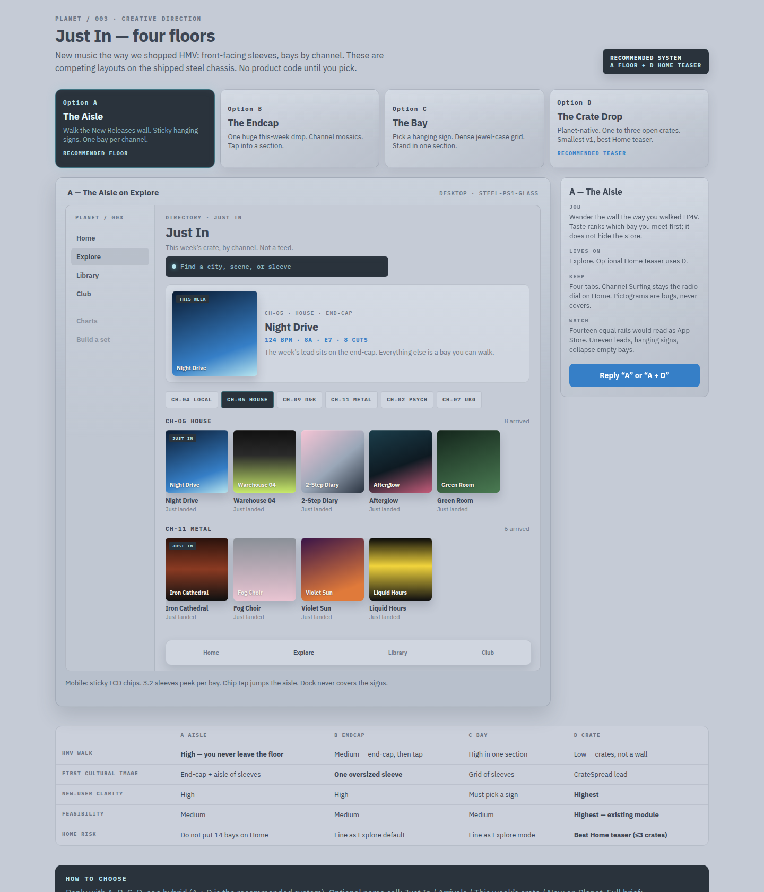
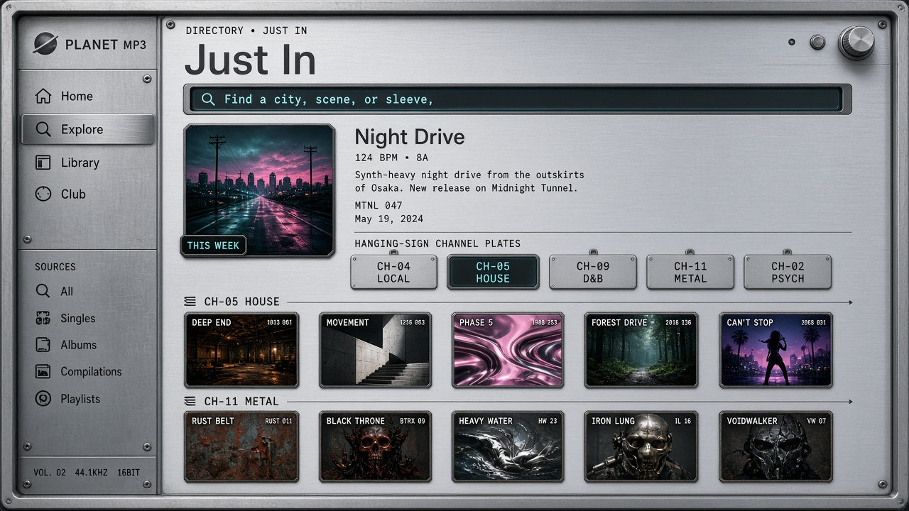
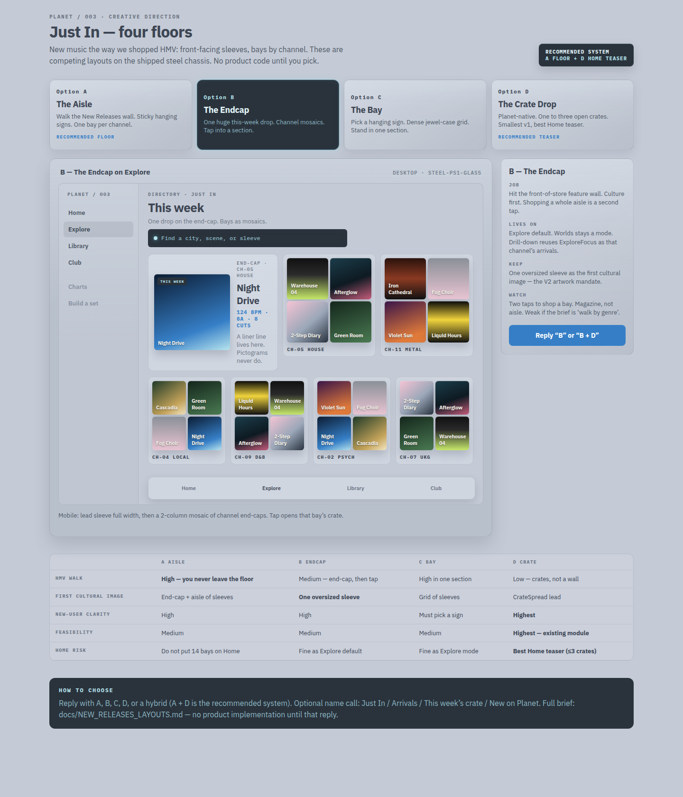
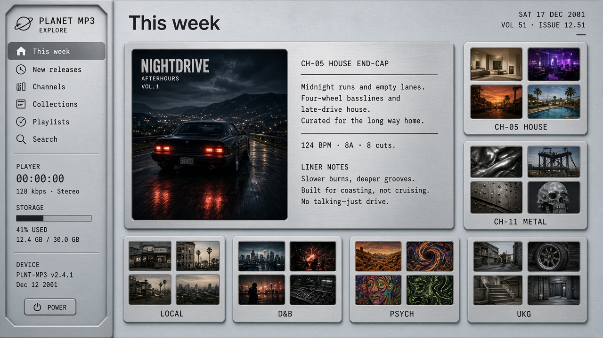
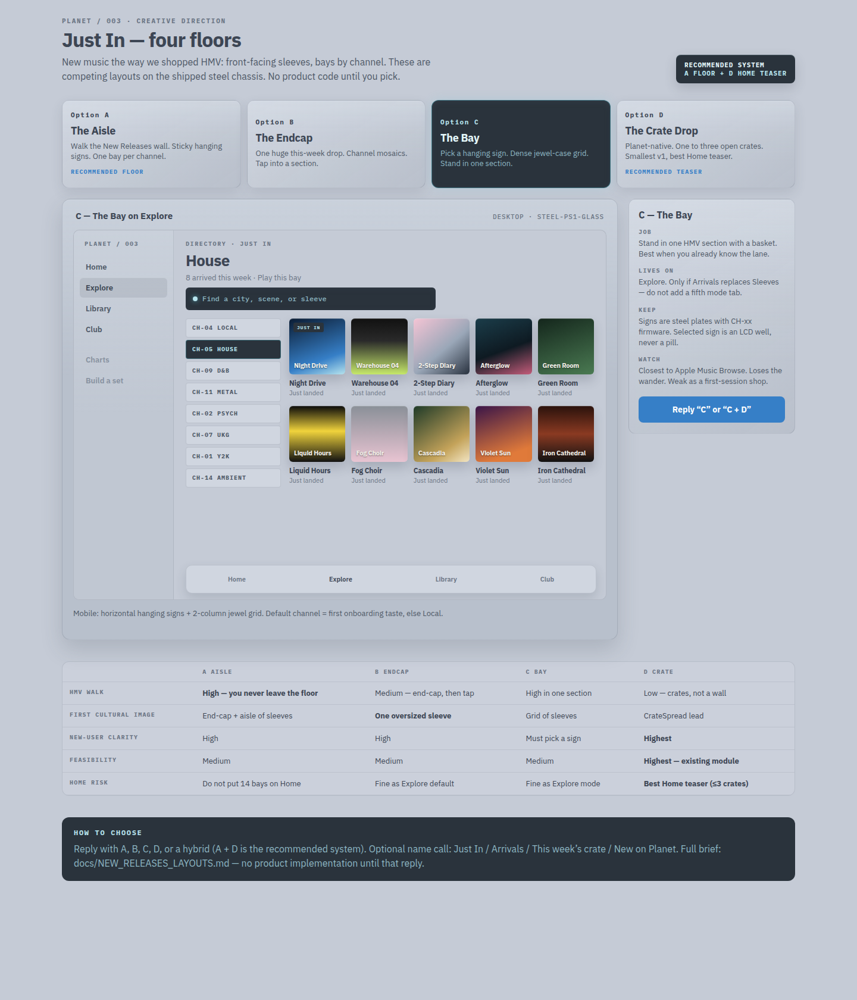
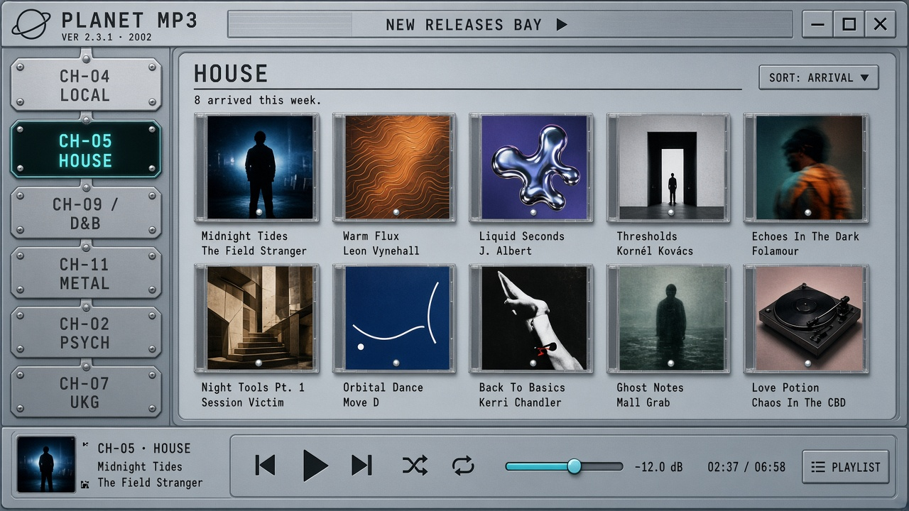
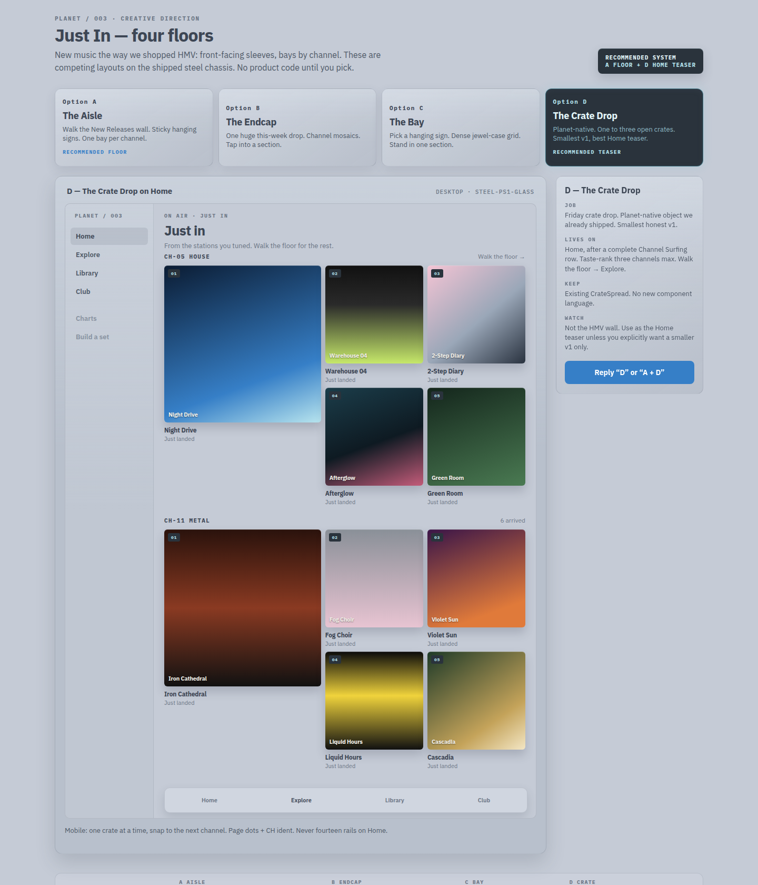
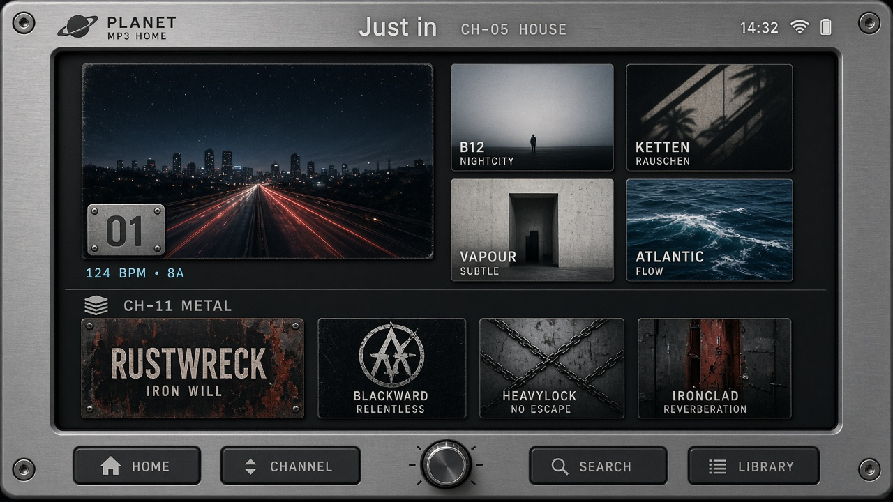

# Just In — New releases by channel

**Status:** layout decision. No product code in this pass.  
**Date:** 21 September 2026  
**Brief:** Let a listener shop new music the way we used to walk HMV — front-facing sleeves, bays by genre / channel — without turning PlanetMP3 into iTunes Browse.

Reply with **A, B, C, D**, or a hybrid (example: *A floor + D Home teaser*). Implementation starts after that call.

**Product-accurate layouts (steel chassis, click to compare):** [`docs/new-releases/chooser.html`](new-releases/chooser.html)

Mood comps below are direction, not chrome to copy. The chooser is the contract. The generated frames lean hardware-skin; we will execute on the shipped web OS (sidebar + Explore canvas + sleeves), not a new Discman costume.

---

## 1. The job

HMV did not algorithmically “surface content.” You walked in, hit the **New Releases wall**, and moved by **section**: Dance, Rock, Hip-Hop, Metal. Covers faced you. A hanging sign named the bay. An end-cap held the week’s drop. You could wander, or plant yourself in one aisle and flip.

PlanetMP3 already has the right *nouns* for this:

| HMV | PlanetMP3 |
|---|---|
| Genre bay | Scene **channel** (CH-01…14) — House, Techno, UKG, Local… more honest than the 11 canonical genres |
| Front-facing CD | **Sleeve** (`ArtFrame`, `ReleaseCard`) |
| Hanging sign | Channel ident `CH-05  HOUSE` + pictogram **bug** (never the hero image) |
| End-cap of the week | One oversized lead sleeve |
| “Just in this week” | Catalog **arrivals** (`createdAt` / batch wave) |
| Flip through a bay | Horizontal crate / snap rail |
| Shop floor | Explore (crate geography) |
| What’s playing over the PA | Home hero device |

This is **shopping**, not **tuning**. Channel Surfing on Home remains the radio dial. Just In is the crate you walk.

---

## 2. What “new” means here

PlanetMP3 is a curated crate, not a major-label street-date calendar. We do **not** have reliable original-release Discogs dates on every cut.

**New = just landed on the Planet.**

1. Primary sort: `createdAt` descending (ingest / batch wave).
2. Window: last **14 days**, then fill per channel to a floor of **6 sleeves** from the newest beyond that window so quiet bays do not look closed.
3. Prefer **albums** (`buildAlbums`, real cover, skip `"Singles & Unknown"` dumps). Orphan singles sit as one-track sleeves at the end of the bay.
4. Empty channel → **collapse the bay**. Never “No new House.”
5. Taste ranks **which bay you meet first**. It does not hide the rest of the floor.
6. Optional later: a `JUST IN` LCD plate vs `NEW TO YOU` (unplayed in that channel). Not required for v1.

This is HMV “what arrived this week,” not Billboard “what the industry released Friday.”

---

## 3. Constraints we will not violate

From the shipped IA and the last two audits (`CREATIVE_UX_AUDIT_V2`, `MOBILE_UX_AUDIT`):

- **Four tabs.** Home / Explore / Library / Club. No fifth destination.
- **Home is the device + Channel Surfing.** Do not bury the first-fold station row under fourteen genre rails.
- **Explore is crate geography.** Worlds / Energy / Sleeves / Mix stay; we add a shop floor without turning Explore into a second Home.
- **Artwork first.** Channel pictograms are corner bugs. Game Icons are never `albumCover`.
- **One crate / mosaic language**, not App Store “See All” rails. No 980px pills. Radius 4 / 6 / 8 / 12.
- **Reuse** `CrateSpread`, `ReleaseCard`, `ChannelCard`, `ExploreFocus`, `buildAlbums`, `decorateSceneChannels`. No new libraries, no new font.
- **Steel chassis + LCD phosphor.** Sleeves carry the culture; chrome stays metal.

---

## 4. Where it lives (IA, shared by every layout)

```text
Home          →  device  →  Channel Surfing  →  one “Just in” teaser (optional)
Explore       →  FIND  →  [ shop floor lives here ]
Library       →  yours (unchanged)
Club          →  membership (unchanged)
```

**Explore owns the shop. Home may tease one crate.**  
Tapping a Home teaser or a hanging sign deep-links into the same Explore floor (channel scrolled into view, or `ExploreFocus` for that channel’s arrivals). Search stays the existing LCD field.

We do **not** add a fifth Explore mode tab if we can help it — mobile already struggles with 10px Worlds / Energy / Sleeves / Mix. Each layout below states how it uses those modes.

---

## 5. Four competing layouts

Open the [chooser](new-releases/chooser.html) to see them on the steel chassis. ASCII below is the contract.

### A — The Aisle *(recommended floor)*

**Metaphor:** You walk the New Releases wall. Each channel is a bay with a hanging sign. Sleeves face you. Sticky index at the top.



Mood (not chrome to ship): 

```text
 Explore · Just In                         Find a city, scene, or sleeve
 ┌─ THIS WEEK ─────────────────────────────────────────────────────────┐
 │  [  320 sleeve  ]  Night Drive — Afterglow          CH-05 HOUSE     │
 │                    8 cuts · 124 BPM · 8A            JUST IN         │
 └─────────────────────────────────────────────────────────────────────┘
  CH-04 LOCAL   CH-05 HOUSE   CH-09 D&B   CH-11 METAL   CH-02 PSYCH  →
  ───────────   ■             ─           ─             ─

  CH-04  LOCAL                              6 arrived
  [sleeve] [sleeve] [sleeve] [sleeve] [sleeve] →

  CH-05  HOUSE                              8 arrived
  [LEAD 2×] [ ] [ ] [ ]
            [ ] [ ]
```

**IA:** Explore default land **or** a first-class aisle *above* the existing mode tabs (Worlds becomes the second beat). Home teaser optional (see D).

**Desktop:** Sticky hanging-sign row (scroll-spy). Featured end-cap. Stacked bays; first sleeve in each bay is larger. Snap-scroll rails.

**Mobile:** Sticky LCD chips. 3.2 sleeves peeking per bay (you can tell there is more). Chip tap jumps to that bay. Dock never covers the hanging signs.

**Why it is HMV:** spatial wandering, section signs, cover-led, you never leave the floor.

**Risk:** fourteen equal `MusicSection` rails = App Store. Mitigation: hanging signs (not See All), uneven lead, empty bays collapse, one end-cap only, max ~8 visible channels then “More bays” using remaining taste-ranked channels.

**Build from:** `ReleaseCard` + `Rail` + channel ident chrome. New: sticky index + `justInByChannel()` helper.

---

### B — The Endcap

**Metaphor:** Front-of-store feature wall + Mixmag spread. One huge drop. Channel bays become **mosaic tiles**. Tap a tile to enter that section.



Mood (not chrome to ship): 

```text
 ┌──────────────────────────┬────────────────────┐
 │                          │  CH-05 HOUSE       │
 │   THIS WEEK              │  [mosaic 2×2]      │
 │   [ oversized sleeve ]   ├────────────────────┤
 │   liner / credits line   │  CH-11 METAL       │
 │                          │  [mosaic 2×2]      │
 └──────────────────────────┴────────────────────┘
 [ CH-04 LOCAL mosaic ] [ CH-09 D&B ] [ CH-02 PSYCH ] [ CH-07 UKG ]
```

**IA:** Explore default (Worlds remains a mode). Drill-down reuses `ExploreFocus` as **that channel’s arrivals crate**, not the whole catalog folder.

**Desktop:** Magazine bento, 1120 canvas Explore already has.  
**Mobile:** Lead full-bleed, then 2-col mosaics.

**Why it is HMV:** the end-cap you hit when the doors opened.

**Risk:** two taps to *shop* a bay. More magazine than aisle. Wins if we care more about one cultural image than walking.

**Build from:** `CrateSpread` lead + existing Explore mosaics + `ExploreFocus`.

---

### C — The Bay

**Metaphor:** You pick a hanging sign, then you are *in* that HMV section. Dense jewel-case grid. The rest of the store is one tap away, not on screen.



Mood (not chrome to ship): 

```text
  CH-04  CH-05  CH-09  CH-11  CH-02  CH-07  →     (hanging signs)
  ─      ■      ─      ─      ─      ─

  HOUSE · 8 arrived this week · Play this bay

  [ ] [ ] [ ] [ ] [ ]
  [ ] [ ] [ ] [ ] [ ]
```

**IA:** Explore mode **Arrivals** — only if we *replace* Sleeves (albums-as-objects) rather than adding a fifth tab. Default channel = first onboarding taste, else Local.

**Desktop:** Vertical hanging-sign index (left, 160px) + 5–6 col grid.  
**Mobile:** Horizontal signs + 2-col grid.

**Why it is HMV:** standing in Dance with a basket, flipping.

**Risk:** closest to Apple Music Browse if the signs read as iOS chips. Mitigation: signs are steel plates with `CH-xx` firmware, not capsules; selected sign is an LCD well, not a filled pill.

**Build from:** `ReleaseCard` grid + channel plates from onboarding.

---

### D — The Crate Drop

**Metaphor:** Friday crate drop, Planet-native. Not a wall — three open crates. Existing `CrateSpread` (lead 2×2 + four cuts).



Mood (not chrome to ship): 

```text
  Home, after Channel Surfing (or Explore if we refuse Home weight):

  Just in · from your stations
  CH-05  HOUSE
  [#1 2×2 sleeve] [2] [3]
                  [4] [5]

  CH-11  METAL
  [#1 2×2 sleeve] [2] [3]
                  [4] [5]

  Walk the floor → Explore
```

**IA:** Home band **after** a complete Channel Surfing row (mobile audit P0.2). Taste-rank **three** channels max. “Walk the floor” opens the full A/B/C floor on Explore.

**Desktop:** 960 Home column, two or three crates.  
**Mobile:** one crate, then horizontal snap to the next channel crate (page dots + CH ident). Not fourteen rails.

**Why it is Planet:** we already shipped this object. Highest feasibility. Does not fight the device.

**Risk:** it is not the HMV *wall*. Only three bays. Home is already tight. Use as **teaser**, not the whole shop — unless we explicitly want a smaller v1.

**Build from:** `CrateSpread` + `rankChannelsForTaste`. Almost no new UI.

---

## 6. Recommendation

**Ship A as the Explore shop floor. Use D as a Home teaser of one–three taste-ranked crates.**

| | A Aisle | B Endcap | C Bay | D Crate |
|---|---|---|---|---|
| Feels like walking HMV | **High** | Medium | High (one section) | Low |
| Artwork as culture | High | **Highest** | High | High |
| First-session clarity | High | High | Medium (must pick a sign) | **Highest** |
| Mobile fold / dock | Good if chips sticky | Good | Good | Good if ≤1 crate above dock |
| Risk of App Store rails | Medium (must execute) | Low | Medium (chips) | Low |
| Feasibility | Medium | Medium | Medium | **Highest** |
| Uses existing modules | Rail + ReleaseCard | Mosaic + Focus | Grid + plates | **CrateSpread** |

**Do not pick C as default** unless the product call is “I always know my lane.” Onboarding already captured three stations; A still puts those bays first.

**Do not pick B as the only floor** if the brief is *shop by genre*. B is the best *hero*. It is a weak *aisle*.

**Do not put A’s fourteen bays on Home.** That would undo the mobile fold work.

---

## 7. After you pick — implementation plan

No code until the layout call. Then, in order:

**Pass 1 — data (shared, layout-agnostic)**  
`justInByChannel(tracks, { windowDays: 14, floor: 6, limit: 8 })`  
→ `[{ channel, albums, tracks, arrivedAt }]`, empty omitted, taste-stable order. Unit tests against fixtures with `createdAt`. Reuse `decorateSceneChannels` + `buildAlbums`.

**Pass 2 — Explore floor (A, B, or C)**  
One module. Sleeve-led. Hanging signs. No See All. Drill-down into existing album / `ExploreFocus` routes.

**Pass 3 — Home teaser (D)** only if the pick includes it. One `CrateSpread` (or snap of three). Action: “Walk the floor.”

**Pass 4 — empty / sparse**  
Catalog with no arrivals in 14 days still shows the floor-fill. Zero playable audio uses the existing quiet empty voice (“New music will appear here.”) — no fake sleeves.

**Non-goals for v1:** original-release street dates, a fifth tab, a fifth Explore mode *unless* C replaces Sleeves, pictogram heroes, “New for you” personalization beyond bay order.

---

## 8. How to choose

Reply with one letter, or a hybrid:

- **A** — Walk the wall (recommended Explore floor)
- **B** — Magazine end-cap, then mosaics
- **C** — Stand in one bay (grid)
- **D** — Crate drop only (smallest v1)
- **A + D** — recommended system (floor + Home teaser)
- **B + D** — hero culture on Explore, crates on Home
- **C + D** — grid shop + Home teaser

If you want a different name on the hanging sign (`Just In` / `Arrivals` / `This week’s crate` / `New on Planet`), say that in the same reply.
