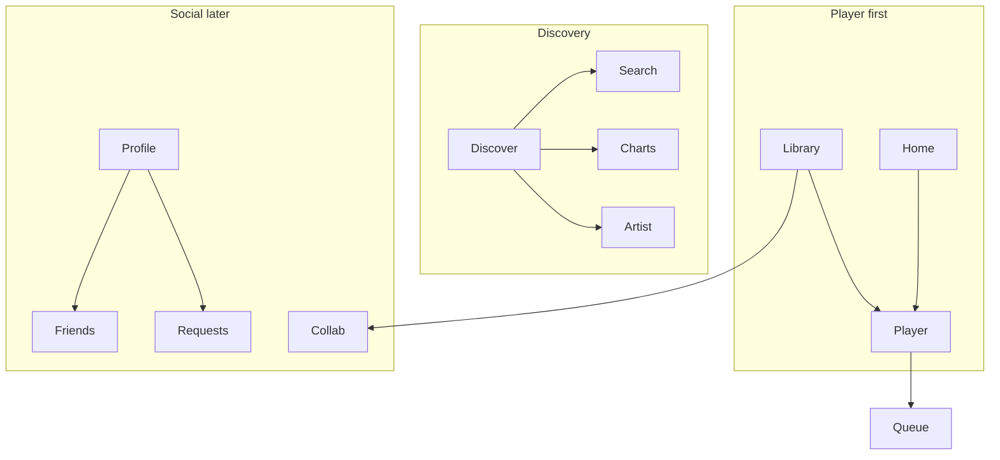

# PlanetMP3 — Premium MP3-player audit & upgrade plan

**Date:** 25 September 2026  
**HEAD:** `ef204d5` — Turtle/Rabbit on the listening deck; Library recents; Discover dock  
**Chassis today:** `steel-ps1-glass-20260919`  
**Status:** Audit approved to proceed in sequenced PRs. See [`docs/PREMIUM_PLAYER_PROMPTS.md`](PREMIUM_PLAYER_PROMPTS.md). Do not ship P0–P2 in one change.

**Product principle:** PlanetMP3 = modern MP3 player first, music discovery around that collection second, social layer third.

**This brief’s visual focus:** make **all text and containers** feel premium and modern — dark charcoal, bold condensed/rounded type, rounded cards, neon green with quiet purple/blue — without turning the app into Spotify or a costume Discman.

---

## Current-state audit

PlanetMP3 is a strong **shared-catalog listening device** that recently pointed the dock at the player. It is **not yet** a personal MP3 collection, a dark premium App Store product, or a music-social network.

The last few commits already match the product order:

| Dock today | Job |
|---|---|
| **Home** | Player hero + recents/likes + editorial + Channel Surfing |
| **Library** | Playlists, liked, recents (`/discover`) |
| **Discover** | Crate directory (`/explore`) |
| **Profile** | Club membership, interests, guide (`/you`) |

That IA is the right skeleton. The **chrome, copy, and Home gravity** still belong to a Y2K radio station on **light steel**, not a dark personal player.

### Product — what exists

| Layer | Shipped | Notes |
|---|---|---|
| **Player** | Home hero, immersive now-playing, collapsed mini, queue sheet, dual-deck audio + crossfade | Turtle / Rabbit (BPM next-picks), LCD BPM / Camelot / energy / MP3 bitrate, like, dislike, share, seek |
| **Library** | Playlists, Liked, Recents, stack detail, community mix | Guest gated. Playlists live on `users/{uid}.playlists` |
| **Discovery** | New Releases, Worlds, Energy, Keys (Camelot), Dig, Search, Charts, Channel Surfing | History tab hidden until tracks have `year` |
| **Radio / station** | Scene channels, program guide, bumpers, dedications, station chat, countdown requests | Still occupies Home below the fold |
| **Identity** | TasteTuner, Club card, billing/paywall, free-play meter | Profile = Club + settings, not a music identity |
| **Catalog pages** | Artist, album, liner notes | Derived from tracks, not a separate entity store |

### Product — missing vs this brief

| Wanted | Today |
|---|---|
| Personal **MP3 collection** (my files) | Shared admin catalog. Users like / playlist / listen. **No user upload.** |
| Home = **my library activity** + light discovery + friends | Home = **player + radio station** (channels, tonight, most requested) with recents/likes bolted on |
| Friends, currently listening, comments, reactions | **None.** Station chat is a public radio room. `users` docs are owner-read only |
| Public profiles / avatars as music identity | Private Club card + Google photo. No public profile route |
| Collaborative playlists | Owner-only mixes. Community Mix is admin monthly |
| Requests as a screen | `requestCount` on tracks + Dedicate sheet. No Requests destination |
| Charts by genre / city / friends | One **monthly countdown** from plays + requests |
| Friends activity on Home | Impossible with current Firestore rules |

### Confusing flows / weak UX

1. **Home is still a station.** DJ greeting, Live/Standby, Channel Surfing, Tonight program guide sit above/beside personal recents. First impression is radio, not “my MP3s.”
2. **Vocabulary split.** Firmware words (cuts, Worlds, Dig, crate, Pace, On Air) vs consumer words (Library, Discover, Profile). Tour says “Your player”; header says “Late signal.”
3. **Library is not a collection.** It is likes + playlists over the **same public crate**. Empty guest state sends you to Profile to sign in — correct, but the product never lets you *own files*.
4. **Discover is a six-mode directory.** New / Worlds / Energy / Keys / Dig (+ History) compete. No Trending / Underground / Community picks as named sections.
5. **Profile is Club billing.** Membership card is beautiful and on-brand, but it is not “music identity, favourites, playlists, history.”
6. **Search is a fourth surface**, not a tab: Home field, Discover field, `/search`. Fine if one pattern; today two LCD wells + a full screen.
7. **Three listening objects remain** (hero, mini, immersive) — already improved (mini no longer expands; tap opens immersive; Turtle/Rabbit stay on hero + immersive). Still a lot of chrome for one song.
8. **More menu** holds Charts + Build a set. Charts is a key screen in this brief but not first-class on the phone.

### Duplicate / leftover

- **Station vs player:** Channel Surfing, Tonight, station chat, dedications, Hypno Vision, Afterglow, Set Builder — rich, but they fight “MP3 player first.”
- **Club vs Profile:** dock says Profile; screen is `ClubScreen`; copy still says “Sign in from Club” in playlist save.
- **LoginScreen.jsx** unused (`LandingScreen` imported as `LoginScreen`). **OnboardingRitual**, **GenreTasteOnboarding**, **ScenesBrowser**, **PlaylistCard** unused. **CoverStage** quarantined. Rooms/Paths routes redirect Home.
- README still describes **Home / Explore / Library / Club** and “broadcast Home.” Live nav is Home / Library / Discover / Profile.
- Older audits (`MOBILE_UX_AUDIT.md`, `CREATIVE_AUDIT_2026-09.md`) score the **steel radio** era. Do not execute them as written against this brief.

### What should be preserved (do not throw away)

- Turtle / Rabbit as **next-picks BPM**, not playback speed.
- LCD metadata: BPM, Camelot, energy, MP3/bitrate.
- Dual-deck audio, skip/crossfade, queue, Media Session.
- Library tabs: Playlists / Liked / Recents + stack URLs.
- Catalog sleeves as the visual unit (not pictograms).
- Camelot Keys board, Dig, Search + Camelot rail.
- Charts countdown + request heat (reposition, don’t delete).
- TasteTuner (short), feature tour (already 3 beats).
- Club membership as **P2 identity object**, not the 4th tab’s whole job.
- `styleShip.test.js` as a lockfile — **rewrite the lock** when the chassis changes; don’t sneak around it.

---

## UI audit

### Typography

- **IBM Plex Sans** 400/600/700 + **IBM Plex Mono** 500/700. Technical, not condensed, not rounded.
- Scale exists (`type.largeTitle` 34 / `title1` 28 / body 17) but **most UI ignores it**: 9–13px uppercase mono labels, 11px greetings, 13px section titles mixed with 34px Discover H1.
- `y2k.offWhite` is **graphite `#3D4654`** on steel — names lie. Body text is mid-grey on grey (`#4E5866` on `#C5CBD6`). Premium type needs a real ink/paper pair.
- Home has **no visible title** (`sr-only` “Home”). Discover and Library do.

**Gap vs brief:** need a **display face** (bold condensed or soft-rounded) for titles, and a **clean SF-like body**. Mono stays for BPM / Camelot / time only.

### Layout & navigation

- Mobile-first column, max ~1100px, bottom dock + optional mini.
- Desktop: source list (Home / Library / Discover) + tools (Charts, Build a set). Profile is dock-only.
- Safe areas exist. Header icon buttons are 44px. Mini + tabs still eat the fold.
- **Radius is inconsistent:** hardware keys 6px (“never pill”), cards 8–18px, dock 12px, `radius.pill` exists but is unused. Brief wants **rounded cards + pill controls**.

### Colour

`theme.js` is explicit: *“No black void, no white page, no neon.”* Canvas is **light steel `#C5CBD6`**. Accents are ice-cyan LCD (`#5AA8B8` / `#B7E4EE`). `neons.lime` exists (`#6DBF87`) but is not the brand. `y2k.cyan` is graphite.

**Gap vs brief:** invert the OS — **dark charcoal page**, neon green signal, purple/blue as secondary. Keep album art as the hue. Do not flood fills with neon.

### Components

- Strong primitives: `CardContainer`, `TrackCard`, `TrackRow`, `ArtFrame`, `PlayerDeck`, `GlassDock`, `LcdPanel`.
- Almost everything is **inline style** against tokens. Good for one chassis; expensive to restyle twice.
- Mixed dialects: steel modules, LCD wells, Music.app library mosaics, Club collectible card, Explore crate poetry.

### Mobile / states

- Loading: Home “Stand by”, Explore “Tuning the crate…”, generic “Loading…”, `CatalogSkeleton` off-Home.
- Empty: Home shelves, Explore, Library, Charts, guest gates — present but **copy and surfaces don’t match**.
- Errors: Home catalog retry is the clearest. Others are thin.
- Console: CoverImage `fetchPriority` already fixed in a prior pass. Guest Home before auth is intentional and good.

---

## Technical audit

| Area | State |
|---|---|
| **App** | CRA React 18, `react-router-dom` 6, Firebase 11, Lottie. **No CSS-in-JS lib, no design-system package.** |
| **God object** | `App.jsx` ~3845 lines: playback, catalog, routing, playlists, billing, station, overlays. |
| **State** | React state + small stores (`playerTransportStore`, `playerPlaybackStore`, `playerEnergyStore`, `playerSignalStore`). Not Redux. |
| **Catalog** | Firestore `tracks` + CDN JSON + `catalog/homeLite` + IndexedDB. Fields: title, artist, album, cover, audioUrl, duration, bpm, camelot, energy, genre, play/like/request counts, optional year. |
| **User** | `users/{uid}`: likes, recents, playlists, taste, billing. **Private.** |
| **Backend** | Functions: Stripe, listening meter, homeLite, catalog JSON, station-chat moderate. |
| **Playback** | Dual `<audio>`, instant skip, crossfade, energy engine (lawnmower BPM/Camelot). |
| **Tests** | Large Jest suite; `styleShip.test.js` **locks light steel + IBM Plex + Turtle/Rabbit**. |
| **Ship** | Committed `build/` for Cloudflare Pages. Visual changes **must** rebuild `build/`. |
| **Dead / risk** | Unused screens listed above; Rooms libs still imported for atmosphere; `build/` staleness; Firestore rules deploy is a human step. |

Hardcoded/mock: channel copy and show guide are **editorial code**, not Firestore. Preview fixtures exist (`#site-preview`) — keep them.

---

## What to keep

1. Player-first dock: **Home / Library / Discover / Profile**.
2. Hero + immersive + collapsed mini (no expanded mini sheet).
3. Turtle / Rabbit, LCD BPM & Camelot, queue, like, share.
4. Library playlists / liked / recents.
5. Sleeve-led TrackCard / album art.
6. Discover as crate geography (trim modes, don’t Spotify-ify).
7. Charts + request heat as community layer.
8. Audio engine and catalog pipeline.
9. Guest can hear Home before auth.

## What to improve

1. **Visual OS:** dark charcoal, premium type, rounded containers, green/purple-blue trim. This is the P0 the brief asks for.
2. **Home gravity:** personal listening first; Channel Surfing / Tonight demoted or later.
3. **Type hierarchy:** one display style for titles, one body, mono only on firmware.
4. **Container language:** one card, one pill, one list row — stop mixing steel bezels and Music.app chrome.
5. **Copy:** MP3 player English. Retire Faceplate/cuts/On Air from consumer chrome (keep in LCD if useful).
6. **Profile** actually shows music identity; Club card becomes a section.
7. **Discover** sections named like music: New, Trending, Underground, Genres, Artists — Camelot/Dig as tools inside, not peer “tabs” of equal weight.
8. Later: public profiles, friends, collaborative playlists, user-owned files (true MP3 collection).

---

## New information architecture

Keep **four tabs**. Do not add Friends/Charts/Requests to the dock.

```text
Home        Personal player + recents/likes
            light discovery rail · optional friend row (P2)
Library     My collection: playlists, liked, recents, history
Discover    New · Trending · Underground · Genres · Artists
            tools: Search, Keys, Dig, Charts
Profile     Avatar, listening identity, playlists, activity
            Club / plans · Friends · Requests (P1–P2)
Overflow    Charts, Build a set, Admin
Player      Full-screen now playing (not a tab)
```



**Home stack (proposed):**  
Header (wordmark + Find) → **Player** → Recently played → Liked → one discovery shelf → (P2) friends listening.

Channel Surfing + Tonight move to Discover or overflow — they are radio, not the MP3 core.

---

## Screen-by-screen upgrade plan

| Screen | Keep | Upgrade (text + container first) | Later |
|---|---|---|---|
| **Home** | Hero deck, Turtle/Rabbit, recents, likes | Dark stage, large title type on track, rounded player card, drop DJ greeting | Friend activity rail |
| **Player** | Sleeve, LCD bits, transport, queue | Bigger art, quieter chrome, premium title/artist, pill controls | Comments/reactions on the track |
| **Library** | Three segments + mosaics | Dark crate header, rounded playlist cards, BPM/key on rows already — keep | User uploads, collab stacks |
| **Discover** | Sleeves, New, Keys, Dig | One H1 + rounded section cards; fewer equal tabs; Search field as the find control | Underground, community picks |
| **Search** | Ranked tracks, Camelot, genres | Same field chrome as Discover; larger result type | |
| **Profile** | Club card, interests | Lead with avatar + now playing + playlists; Club as membership block | Public profile URL |
| **Friends** | — | — | New. Needs public presence model |
| **Charts** | Podium + countdown | Overflow from Discover/Profile; dark board, same type | Genre / city scopes |
| **Requests** | Dedicate + requestCount | — | Dedicated screen from Profile / Charts |
| **Playlists** | Stack detail, share, reorder | Rounded artwork, clear Play; “collaborative” badge only when real | Multi-owner writes |
| **Auth / onboarding** | Landing lockup, TasteTuner | Dark premium type on the same flow | |
| **Charts/Set/Chat** | Working | Demote visually; don’t redesign first | |

---

## Design-system direction

**Do not** keep the light steel page and “paint neon on it.” **Do not** build a skeuomorphic Discman. **Do** invert to a dark OS and let artwork + one green signal carry identity.

### Colour (proposed)

| Role | Direction |
|---|---|
| Canvas | Dark charcoal (~`#121417`–`#1A1D22`), not pure black |
| Surface | Raised charcoal cards (`#1E2228`) |
| Ink | Near-white titles, muted silver body |
| Signal | Neon green (pip, play, progress, liked) |
| Accent 2 | Quiet violet / electric blue (keys, avatars, secondary chips) |
| Live/alert | Keep red, rare |
| LCD | Dark well, green or ice readout — firmware only |

### Type (proposed)

| Role | Direction |
|---|---|
| Display | Bold condensed or rounded-sans for titles (Home track, screen H1, section) |
| Body | 15–17px, SF-like, tight but readable |
| Meta | 13px, not 9px uppercase soup |
| Firmware | IBM Plex Mono **only** for BPM, Camelot, time, bitrate |

Ship with a **small licensed/self-hosted pair** (do not Google-font flash). `styleShip` must be updated in the same PR as the font change.

### Containers

| Token | Direction |
|---|---|
| Card | 16–20px radius, 1px hairline, soft shadow, no chamfered aluminum |
| Artwork | Large, 12–16px radius, dominant |
| Chip / tab / search | **Pills** |
| Transport keys | Round or pill; Turtle/Rabbit stay recognizable glyphs |
| List row | Full-width, 44px+ hit, title 16–17, meta 13 with BPM · key |

### Motion

Keep existing short snaps (`motion.fast` / `settle`). Atmosphere slower than chrome. No extra ornament.

### What this pass is *not*

- New mascot, scanlines, PS1 bezels, MTV bugs as page chrome.
- Spotify green-on-black clone (green is **trim**, art is the colour).
- Rewriting the audio engine or catalog.

---

## Technical / data gaps

| Gap | Blocks | Priority |
|---|---|---|
| Light-steel `styleShip` lock | Any dark/type/container pass | P0 — update with the chassis |
| Inline styles × 100s of files | Slow restyle | P0 — tokens first, then screens |
| `App.jsx` monolith | Safe iteration | P1 extract, not a rewrite |
| Users private-only | Friends, public profiles, currently listening | P2 (rules + presence doc) |
| No `year` on many tracks | History / era Discover | P1 data ingest |
| No user audio upload | True personal MP3 library | P2 (Storage rules + ingest UX) |
| Mixes owner-only | Collaborative playlists | P2 |
| No comments/reactions collections | Social on tracks | P2 |
| Playlists as array on user doc | Scale / collab | P1 when stacks grow |
| README / old audits stale | Team confusion | P0 docs (this file) |

---

## Prioritized roadmap

### P0 — Critical (premium player chrome)

The product already plays music. The job is to **look and read like a modern MP3 player**.

1. **Design tokens:** dark canvas, surface, ink, green signal, violet/blue accent, radius (card + pill), type scale (display / body / meta / lcd).
2. **Global text + container pass** on Home, Player (hero + immersive + mini), Library, Discover, Profile, Search, dock. One card, one title style, one list meta.
3. **Home copy/layout:** visible player context; recents/likes directly under the deck; Channel Surfing / Tonight off the first screen.
4. **Update `styleShip.test.js` + `STYLE_CHASSIS` + `public/index.html` theme-color + rebuild `build/`.**
5. **Align leftover “Club” consumer copy to Profile.**

### P1 — High (MP3 collection + discovery around it)

1. Discover IA: New / Trending / Genres lead; Keys + Dig as tools; Search is the find field.
2. Profile: avatar, favourites, playlists, recents — Club card nested.
3. Charts reachable from Discover (keep overflow).
4. BPM / Camelot consistency on every row (already on TrackRow — verify Explore folder).
5. Catalog years backfill; tighten empty/error states to the new cards.
6. Light `App.jsx` splits only where the visual pass is painful (Home props, dock).

### P2 — Future (social + true ownership)

1. Public profile + presence (“listening now”).
2. Friends feed on Home (third, small).
3. Comments / reactions on tracks.
4. Requests screen (promote existing request/dedicate).
5. Collaborative playlists.
6. User MP3 upload / personal files — the real “my collection” if the business wants it.
7. Genre / city charts.
8. Retire or archive station chat / program guide if they still compete.

---

## First implementation step

**Prompt 01** in [`PREMIUM_PLAYER_PROMPTS.md`](PREMIUM_PLAYER_PROMPTS.md) — dark premium tokens only.

Calls already made for the sequence:

1. Invert to **dark charcoal** (not keep light steel).
2. Type: **rounded body (Outfit) + condensed display (Barlow Condensed)**; Plex Mono for LCD.
3. Channel Surfing leaves Home in **Prompt 03**, not the token PR.
